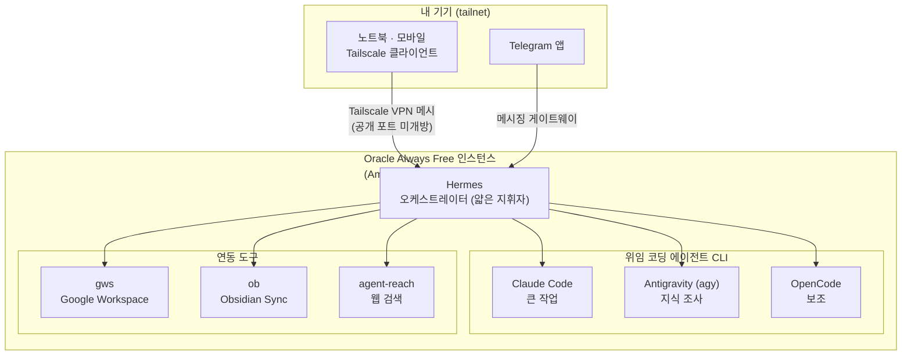
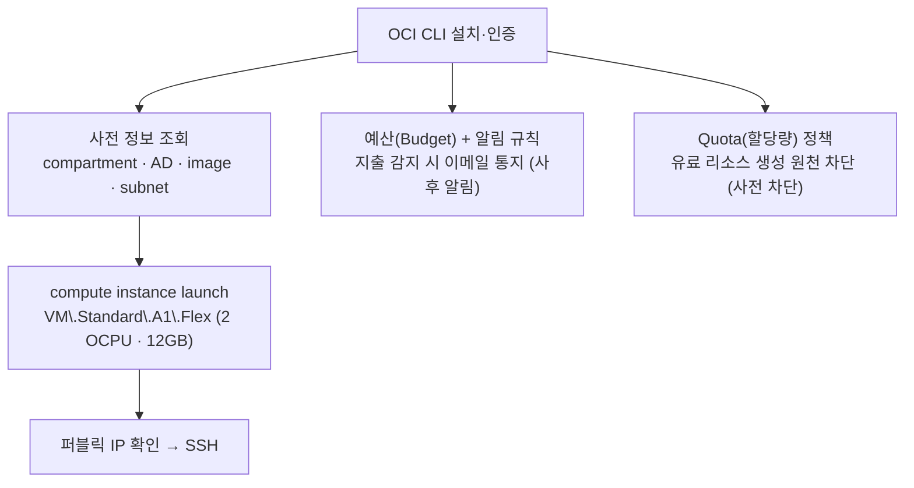
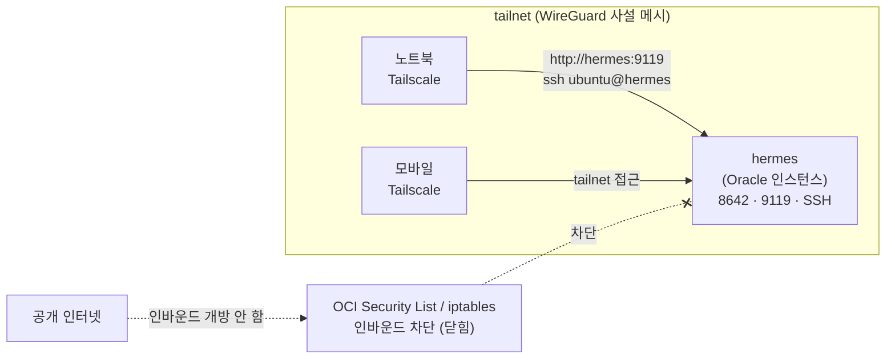
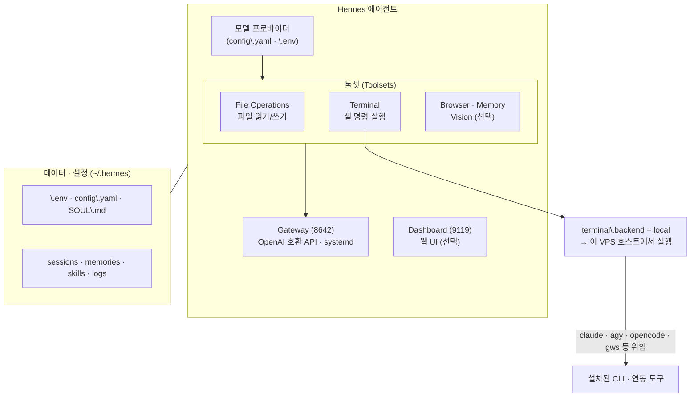
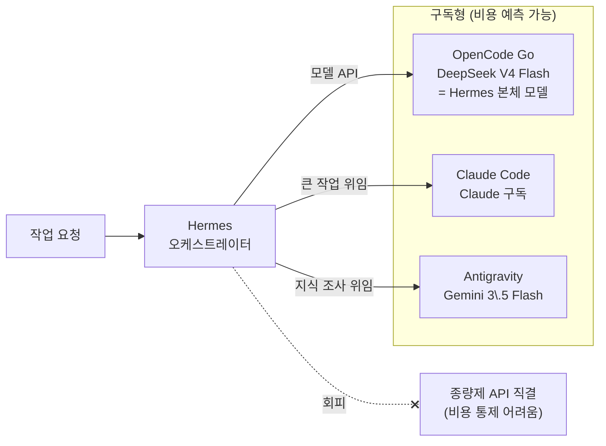
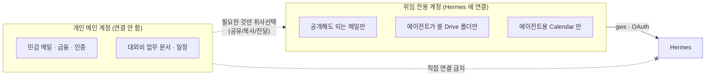
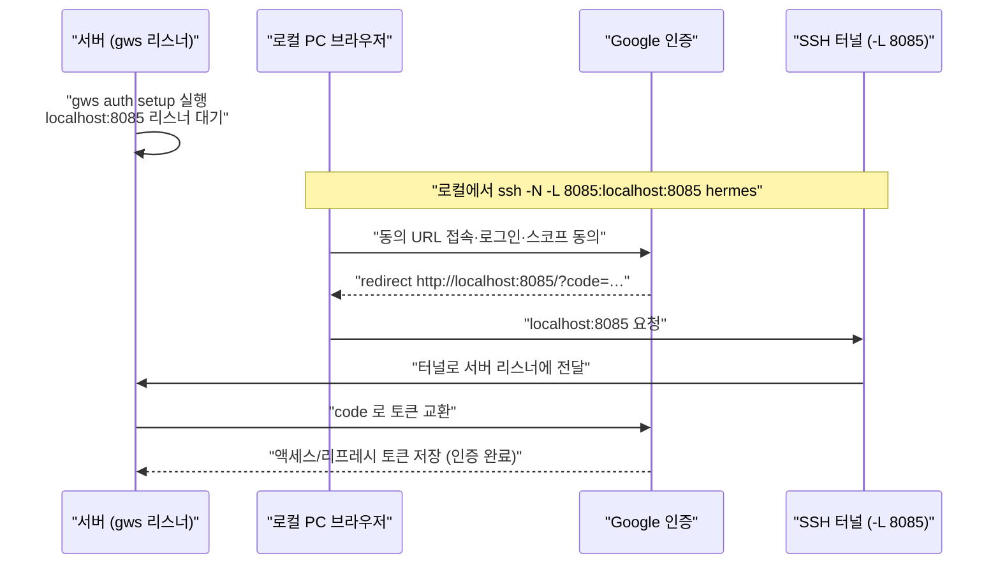
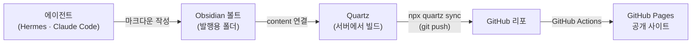

# Quick-Notes - Oracle Cloud 를 이용해서 Hermes Agent 설치하기

## Date

2026-07-07 12:29:17

---

## 개요

개인용 에이전트(Hermes, OpenClaw 등)를 **개인 PC에 직접 설치하는 대신, Oracle Cloud Always Free 인스턴스에 격리된 환경으로 구축**하는 방법을 정리한 노트다. 개인 PC 직접 설치의 보안 리스크를 회피하면서, 상시 구동형 LLM 작업 환경을 무료(또는 저비용)로 확보하는 것이 목표다.

> [!note] 작업 진행형 문서
> 실제 구축을 진행하면서 단계별 절차·트러블슈팅을 계속 보강한다. 아래 목차는 초안 골격이며, 미작성 섹션은 `TODO`로 표시한다.

**전체 구성 한눈에 보기**



---

## 1. 개인 PC에 직접 설치하면 안 되는 이유

Hermes, OpenClaw 를 개인 PC에 그대로 사용하면 안 되는 이유:

- 편의성을 높이려면 결국 **개인의 각종 인증 정보(credential)** 를 에이전트에 연결해야 한다.
- 이 과정에서 권한을 인가하다 보면 **의도하지 않은 중요 정보까지 취득 가능**한 상태가 되어, 문제 상황이 가속화될 수 있다.
- 따라서 신뢰 경계를 분리한 **격리 환경(별도 클라우드 인스턴스)** 에서 구동하는 편이 안전하다.

참고:

- [Reddit - Hermes 101: Why you shouldn't install Hermes on…](https://www.reddit.com/r/hermesagent/comments/1tonn9q/hermes_101_why_you_shouldnt_install_hermes_on/?tl=ko)
- [Reddit - From OpenClaw frustration to Hermes breakthrough](https://www.reddit.com/r/hermesagent/comments/1srhsmd/from_openclaw_frustration_to_hermes_breakthrough/?tl=ko)

---

## 2. Oracle 서버 + Tailscale 구성

> 대안으로 **Oracle Cloud Always Free** 인스턴스를 서버로 쓰고(2.1~2.4), 외부 접속은 **Tailscale VPN**(2.5)으로 처리한다.

### 2.1 Always Free A1 정책 변경 (2026.06 전후)

- 공지: **Always Free A1 Resource Limit Update** — Always Free Ampere A1 Compute 권한(entitlement)이 변경됨. 유료 리소스/워크로드/청구에는 영향 없음.
- **Ampere A1 (Arm) 무료 한도** (전 테넌시 공통, 월 단위):
  - 첫 **1,500 OCPU 시간** + **9,000 GB 시간** 무료 (VM.Standard.A1.Flex shape)
  - Always Free 테넌시 기준 = **2 OCPU + 12 GB 메모리** 상당
- **부트 볼륨**: 인스턴스당 최소 47 GB, 계정당 Always Free 블록 볼륨 **200 GB** 제공 → OCPU 배분에 따라 A1 인스턴스 1~2개 생성 가능(총 2 OCPU).
- 요약: 현재는 **2 vCPU / 12 GB RAM / 200 GB** 한도 내에서 프리티어 이용 가능. 자원 사용률이 낮으면 서버가 정리되는 등의 처리가 수반되는 것으로 보임.

### 2.2 한국 리전 관련 유의사항

- 한국의 경우 **Free Tier 계정으로는 리전 할당 불가** → 반드시 **유료 계정으로 전환** 필요.
- 유료 계정 전환 후에도 **제한 조건에 맞는 리소스는 과금되지 않는다**고 하니 참고.

> [!tip] 홈 리전은 계정 생성 시 고정 — 이 노트의 상황적 특이점
> 이 계정은 **가입(Free Tier 생성) 시 홈 리전을 Tokyo(`ap-tokyo-1`)로 만들었고, 실제 서버는 Seoul 에 만들었다.** 그래서 아래와 같은 특이점이 생긴다:
> - **홈 리전은 가입 시 정해지면 이후 변경 불가**하다. 인스턴스 같은 일반 리소스는 **구독된 다른 리전**(Seoul·Osaka 등)에 자유롭게 만들 수 있다.
> - 하지만 **Budget·Quota 등 계정 거버넌스 서비스는 홈 리전(Tokyo)에서만** 동작한다 → 서버는 Seoul 인데 과금 가드는 Tokyo 로 호출해야 하는 **리전 분리 상황**이 발생.
> - 자기 계정의 홈 리전은 `oci iam region-subscription list` 로 확인한다(2.3 의 `HOME_REGION`). 콘솔에서 새로 가입할 때 **원하는 홈 리전을 신중히 선택**한다(예: 서울 서비스 예정이면 홈도 Seoul 로 두면 이 분리가 없어짐).

### 2.3 인스턴스 생성 (OCI CLI + 예산 한도 가드)

콘솔 클릭 대신 **OCI CLI 로 Always Free A1(Ampere Arm) 인스턴스를 생성**하고, **예산(Budget) + 알림으로 과금 한도를 걸어** 실수 과금을 방지하는 방식으로 구성한다. **리전은 Seoul(`ap-seoul-1`) 을 기본**으로 하되, A1 용량 여유가 없으면 **Osaka(`ap-osaka-1`)** 로 전환한다. 부트 볼륨은 무료 한도 전량인 **200GB** 로 잡는다.

> [!important] 과금 차단은 2단 방어 — Budget(알림) + Quota(차단)
> 2.2 에서 보듯 한국은 **유료 계정 전환**이 필요하다. Always Free 한도 안의 리소스는 과금되지 않지만, **한도를 넘거나 실수로 유료 리소스를 만들면 종량 과금**이 된다. 방어는 두 겹으로 둔다:
> - **Budget(예산)** = **알림만**. 지출이 생기면 통지하지만 **리소스를 막지는 못한다**(4단계).
> - **Quota(할당량) 정책** = **실제 차단**. 유료 리소스 생성 자체를 **원천 봉쇄**한다(5단계). **과금을 확실히 막으려면 Quota 가 핵심.**

**생성 흐름**



#### 1) OCI CLI 설치 · 인증

> [!tip] 가장 쉬운 길 — Cloud Shell
> OCI 콘솔의 **Cloud Shell** 에는 CLI 가 **미리 설치·인증**되어 있다. 로컬 설정이 번거로우면 아래 명령을 Cloud Shell 에서 그대로 실행해도 된다(별도 `oci setup config` 불필요).

```bash
# 로컬(또는 서버)에 설치
bash -c "$(curl -L https://raw.githubusercontent.com/oracle/oci-cli/master/scripts/install/install.sh)"

# 대화형 인증 설정 (API 키 생성 → 콘솔에 공개키 등록 안내가 나온다)
oci setup config
#   생성된 ~/.oci/config 의 공개키(~/.oci/oci_api_key_public.pem)를
#   콘솔 > 사용자 > API Keys 에 등록

oci iam region list --output table   # 인증 확인
```

#### 2) 사전 정보 조회 (환경변수로 자동 캡처)

플레이스홀더를 손으로 치환하지 않도록, 필요한 값을 **환경변수로 캡처**한다. 이후 3~5단계는 이 변수들을 그대로 참조하므로 복붙만으로 실행된다.

```bash
# ── 고정 입력값 (본인 환경에 맞게 한 번만 수정) ──────────────
export REGION=ap-seoul-1                          # 용량 없으면 ap-osaka-1
export SSH_KEY=~/.ssh/id_ed25519.pub              # 등록할 공개키
export EMAIL="you@example.com"                    # 예산 알림 수신 이메일
export DISPLAY_NAME=hermes

# ── 테넌시(루트) OCID ─────────────────────────────────────
#  ※ 'oci iam compartment list' 로는 못 구한다 — 그 명령은 부모 compartment-id(=테넌시)를
#    필수로 요구해 순환이 된다. 테넌시 OCID 는 인증 정보에서 가져온다.
#  ① Cloud Shell: 환경변수 OCI_TENANCY 자동 제공
#  ② 로컬(oci setup config): ~/.oci/config 의 tenancy= 값
export TENANCY=${OCI_TENANCY:-$(awk -F'=' '/^tenancy[[:space:]]*=/{gsub(/[[:space:]]/,"",$2); print $2; exit}' ~/.oci/config)}
echo "TENANCY=$TENANCY"                            # 비어 있으면 아래 [!bug] 참고
export C="$TENANCY"                               # 루트 컴파트먼트에 그대로 생성

# 홈 리전(Budget/Usage/Quota 는 홈 리전에서만 동작 — 4·5단계에서 사용)
export HOME_REGION=$(oci iam region-subscription list \
  --query "data[?\"is-home-region\"]|[0].\"region-name\"" --raw-output)
echo "HOME_REGION=$HOME_REGION"      # 예: 이 계정은 ap-tokyo-1 (도쿄)

# ── 리소스 OCID 자동 조회 (모두 $REGION 기준) ───────────────
# 가용 도메인 (첫 번째 AD 자동 선택)
export AD=$(oci iam availability-domain list -c "$C" --region "$REGION" \
  --query 'data[0].name' --raw-output)

# Ubuntu ARM 이미지 (aarch64, 최신)
export IMAGE=$(oci compute image list -c "$C" --region "$REGION" \
  --operating-system "Canonical Ubuntu" --shape "VM.Standard.A1.Flex" \
  --sort-by TIMECREATED --query 'data[0].id' --raw-output)

# 서브넷 (첫 번째 서브넷 자동 선택 — VCN 이 없으면 콘솔 "VCN 마법사"로 퍼블릭 서브넷 먼저 생성)
export SUBNET=$(oci network subnet list -c "$C" --region "$REGION" \
  --query 'data[0].id' --raw-output)

# 확인
echo "REGION=$REGION"; echo "AD=$AD"; echo "IMAGE=$IMAGE"; echo "SUBNET=$SUBNET"; echo "TENANCY=$TENANCY"
```

> [!bug]- `TENANCY` 가 비어 있을 때 (원인·대안)
> `oci iam compartment list` 로 테넌시를 구하려 하면 **실패**한다 — 이 명령은 부모 `--compartment-id`(=테넌시)를 **필수로 요구**하므로 순환이 된다(에러를 `2>/dev/null` 로 숨기면 그냥 빈 값이 됨). 테넌시 OCID 는 **인증 정보**에서 가져온다.
> - **Cloud Shell**: 이미 `OCI_TENANCY` 가 있다 → `export TENANCY=$OCI_TENANCY`
> - **로컬(`oci setup config`)**: `~/.oci/config` 의 `tenancy=` 값 → 위 `awk` 한 줄이 이를 파싱한다. 프로파일이 여러 개면 원하는 프로파일 블록의 값을 쓰도록 확인.
> - **콘솔 확인**: 우상단 프로필 → **Tenancy: <이름>** → OCID 복사해 `export TENANCY=ocid1.tenancy.oc1..xxxx` 로 직접 지정해도 된다.
> - 참고: `awk` 결과가 비면 config 에 `tenancy` 키가 없거나 경로가 다른 것 → `cat ~/.oci/config` 로 확인.

> [!note] 자동 선택 값 검토 · 변수 지속성
> - 위는 AD·서브넷의 **첫 번째 항목**을 자동 선택한다. 여러 개면 `--query 'data[].{name:"display-name",id:id}' --output table` 로 목록을 보고 원하는 값으로 `export` 를 덮어쓴다. `echo` 출력이 **비어 있으면**(권한/리전/미구독) 해당 리소스를 먼저 만들거나 리전을 확인한다.
> - `export` 변수는 **현재 셸 세션에만 유지**된다. 새 터미널/재접속 시 2)를 다시 실행하거나, 위 블록을 `~/oci-env.sh` 로 저장해 `source ~/oci-env.sh` 로 불러온다.

> [!note] 리소스 리전(`REGION`) ≠ 홈 리전(`HOME_REGION`)
> 두 리전의 역할이 다르다. 이 계정 실측 예시로 정리하면:
> - **`REGION`(리소스 리전)** = 인스턴스·VCN 등을 만드는 곳 → **Seoul(`ap-seoul-1`)**, 용량 없으면 **Osaka(`ap-osaka-1`)**. 구독된 리전이면 자유롭게 선택.
> - **`HOME_REGION`(홈 리전)** = 계정 가입 시 고정되는 리전 → **Tokyo(`ap-tokyo-1`)**. **Budget·Quota 같은 계정 거버넌스는 홈 리전에서만** 생성된다(3단계 launch 는 `REGION`, 4·5단계 Budget/Quota 는 `HOME_REGION`).
> - 즉 인스턴스가 Seoul 에 있어도 Budget/Quota 는 **Tokyo 로 호출**해야 한다. 두 값이 다를 수 있음을 전제로 명령마다 알맞은 `--region` 을 쓴다.

#### 3) 인스턴스 launch (A1.Flex · 2 OCPU · 12GB)

```bash
# 2) 에서 export 한 변수들을 그대로 사용 (치환 불필요)
export INSTANCE=$(oci compute instance launch \
  --region "$REGION" \
  --availability-domain "$AD" \
  --compartment-id "$C" \
  --subnet-id "$SUBNET" \
  --shape "VM.Standard.A1.Flex" \
  --shape-config '{"ocpus": 2, "memory-in-gbs": 12}' \
  --image-id "$IMAGE" \
  --assign-public-ip true \
  --boot-volume-size-in-gbs 200 \
  --ssh-authorized-keys-file "$SSH_KEY" \
  --display-name "$DISPLAY_NAME" \
  --wait-for-state RUNNING \
  --query 'data.id' --raw-output)
echo "INSTANCE=$INSTANCE"
```

- **Always Free 한도(현행, 2.1 참고)**: A1 은 **2 OCPU · 12GB** 상당, 부트 볼륨은 계정 총 **200GB** 내(인스턴스당 최소 47GB). 위 예시는 **2 OCPU / 12GB / 200GB**(무료 블록 볼륨 200GB 를 단일 인스턴스에 전량 할당).
  - 단일 A1 인스턴스에 200GB 를 다 쓰면 **추가 A1 인스턴스용 부트 볼륨 여유는 없다**(200GB 총량 소진). 인스턴스를 2개로 나눌 계획이면 볼륨을 나눠 배분한다.
  - (참고) 정책 변경 전에는 최대 4 OCPU/24GB 였다. 현재는 2/12 기준으로 잡는다.
- **`--region`**: 프로파일 기본 리전과 다르면 위처럼 `--region` 을 명시한다. 기본은 **Seoul(`ap-seoul-1`)**, 용량이 없으면 **Osaka(`ap-osaka-1`)** 로 전환한다(아래 [!warning] 참고).
- **SSH 키**: 2.4 의 1Password SSH-Agent 를 쓸 경우, 1Password 에서 공개키를 내보내 `--ssh-authorized-keys-file` 로 지정한다.
- 생성 후 퍼블릭 IP 확인(변수로 캡처):

  ```bash
  export PUBLIC_IP=$(oci compute instance list-vnics --instance-id "$INSTANCE" \
    --region "$REGION" --query 'data[0]."public-ip"' --raw-output)
  echo "SSH: ssh ubuntu@$PUBLIC_IP"
  ```

> [!warning] "Out of host capacity" — Seoul → Osaka 리전 전환
> Always Free A1 은 인기가 높아 `Out of host capacity` 로 실패하는 경우가 잦다. 우선 **Seoul(`ap-seoul-1`)** 에서 가용 도메인을 바꿔가며 재시도하되, **Seoul 에 여유가 없으면 Osaka(`ap-osaka-1`)** 로 전환해 생성한다(일본 리전은 상대적으로 여유가 있는 편).
>
> **리전 전환 방법 — `REGION` 만 바꿔 2)부터 재실행**
> 1. **리전 구독 확인/추가**: 다른 리전에 리소스를 만들려면 테넌시가 그 리전에 **구독**돼 있어야 한다. 콘솔 **Administration → Region Management** 에서 **Osaka(`ap-osaka-1`)** 를 구독한다(대부분 즉시 가능).
> 2. **변수 리전만 교체 후 재조회**: OCID(AD·이미지·서브넷)는 **리전마다 다르므로**, `REGION` 을 바꾸고 **2)의 조회 블록을 다시 실행**하면 `AD/IMAGE/SUBNET` 이 Osaka 값으로 자동 갱신된다.
> ```bash
>    export REGION=ap-osaka-1
>    # → 2)의 "리소스 OCID 자동 조회" 블록 재실행 (AD·IMAGE·SUBNET 자동 재캡처)
>    # Osaka 에 VCN/서브넷이 없으면 콘솔 VCN 마법사로 퍼블릭 서브넷 먼저 생성
>    ```
> 3. **launch 재실행**: 3)의 launch 명령을 **그대로 다시 실행**한다(변수 참조라 수정 불필요).
>
> - **주의**: 리전을 바꾸면 이후 Tailscale·SSH·접속 IP 등 **모든 후속 단계가 그 리전 인스턴스 기준**이 된다. Seoul/Osaka 중 **한쪽으로 확정**해 진행한다.

#### 4) 예산(Budget) + 알림으로 과금 한도 가드

지출이 생기면 즉시 알림을 받도록 **루트 컴파트먼트에 소액 예산**을 만들고 알림 규칙을 건다.

> [!important] 명령 경로에 `budget` 이 두 번 (`budgets budget budget`)
> OCI CLI 구조상 **서비스 `budgets` → 그룹 `budget` → 하위그룹 `budget` → `create`** 로 중첩되어 있어, 예산 생성은 **`oci budgets budget budget create`**(budget 2회) 로 호출한다. alert-rule 은 **`oci budgets budget alert-rule create`** 다.

```bash
# 예산 생성 (루트 컴파트먼트 대상, 월 리셋) — 생성된 예산 OCID 를 변수로 캡처
#   ※ Budget 은 홈 리전에서만 동작 → --region "$HOME_REGION" 필수
export BUDGET=$(oci budgets budget budget create \
  --region "$HOME_REGION" \
  --compartment-id "$TENANCY" \
  --target-type COMPARTMENT \
  --targets "[\"$TENANCY\"]" \
  --amount 1 \
  --reset-period MONTHLY \
  --display-name "always-free-guard" \
  --query 'data.id' --raw-output)
echo "BUDGET=$BUDGET"

# 알림 규칙 — 실제 지출이 임계를 넘으면 $EMAIL 로 통지
oci budgets budget alert-rule create \
  --region "$HOME_REGION" \
  --budget-id "$BUDGET" \
  --type ACTUAL \
  --threshold 1 \
  --threshold-type ABSOLUTE \
  --recipients "$EMAIL" \
  --display-name "any-spend-alert"
```

- **amount 를 1(USD 등 최소)** 로 두고 **ABSOLUTE 임계 1** 로 걸면, **소액이라도 실제 지출이 발생하는 즉시 알림**이 온다(= Always Free 이탈 조기 감지).
- 백분율 기준으로 걸려면 `--threshold-type PERCENTAGE --threshold 80` 처럼 설정한다.
- **한계**: Budget 은 **통지 전용**이라 리소스를 멈추지 않는다. 알림을 받으면 원인 리소스를 즉시 정리한다. **확실한 원천 차단은 아래 5단계 Quota 정책으로 한다.**

> [!bug]- `NotAuthorizedOrNotFound` (404) — 홈 리전이 아님
> `create_budget` 이 `POST https://usage.<region>.oci.oraclecloud.com/...` 로 가면서 404/`NotAuthorizedOrNotFound` 가 나면, 그 `<region>` 이 **홈 리전이 아니기 때문**이다. **Budget/Usage 서비스는 테넌시의 홈 리전에서만 제공**된다(예: 인스턴스는 Seoul 에 있어도 홈 리전이 다른 리전이면 Seoul 엔드포인트로는 404).
> ```bash
> # 홈 리전 확인 후 --region 으로 지정 (2단계에서 이미 HOME_REGION 캡처)
> oci iam region-subscription list --query 'data[].{home:"is-home-region", name:"region-name"}' --output table
> ```
> - 위 명령 블록처럼 budget/alert-rule 에 **`--region "$HOME_REGION"`** 을 붙이면 해결된다.
> - 그래도 `NotAuthorized` 가 계속되면 **IAM 권한** 문제다 — 예산 관리에는 `usage-budgets` 권한이 필요하다: `Allow group <그룹> to manage usage-budgets in tenancy` (테넌시 관리자면 보통 이미 보유).

> [!bug]- `No such command 'create'` 가 났던 이유 — 경로에 `budget` 이 두 번
> `oci budgets budget create` 로 치면 `No such command 'create'` 가 난다. 원인은 CLI 버전이 아니라 **명령 그룹이 이중 중첩**되어 있기 때문이다. oci-cli 소스 기준 구조:
> ```
> budgets (서비스)
>  └ budget (budget_root_group)
>     ├ budget (budget_group)  → create / list / get / update / delete
>     └ alert-rule             → create / list / get / update / delete
> ```
> 따라서 올바른 경로는:
> - 예산: **`oci budgets budget budget create`**
> - 알림: **`oci budgets budget alert-rule create`**
>
> 헷갈리면 `--help` 로 한 단계씩 내려가며 확인한다: `oci budgets budget --help` → 하위에 `budget` 과 `alert-rule` 두 그룹이 보인다.
>
> **대안(콘솔)**: Billing & Cost Management → **Budgets → Create Budget**(대상=테넌시, 월 리셋, 금액 1) → **Alert Rule**(ACTUAL/ABSOLUTE/임계 1/이메일).

#### 5) Quota(할당량) 정책으로 유료 리소스 원천 차단 (강력 권장)

**Budget 이 사후 알림이라면, Quota 정책은 리소스 생성 시점에 막는 사전 차단이다.** 유료 사양 리소스는 **생성 자체가 거부**되므로 과금이 원천 봉쇄된다. 방식은 **화이트리스트** — "전부 0으로 잠근 뒤, 무료 한도만큼만 허용"이다.

> [!success] 개념: zero(전부 차단) → set(무료분만 허용)
>
> ```
> # 컴퓨트(A1 코어·메모리)
> zero compute-core quotas in tenancy                              # A1 코어 전부 0
> set compute-core quota standard-a1-core-count to 2 in tenancy    # 무료 한도 2 코어만 허용
> set compute-core quota standard-a1-core-regional-count to 2 in tenancy   # 리전별 카운트도 2
> set compute-memory quota standard-a1-memory-count to 12 in tenancy        # 무료 메모리 12GB
> set compute-memory quota standard-a1-memory-regional-count to 12 in tenancy
>
> # 디스크(블록/부트 볼륨) — 무료 총량 200GB 로 상한
> zero block-storage quotas in tenancy                            # 블록 스토리지 전부 0
> set block-storage quota total-storage-gb to 200 in tenancy      # 무료 200GB 만 허용
> ```
> A1 은 **리전별 카운트(`...-regional-count`)** 도 함께 검사되므로 코어·메모리 모두 둘 다 설정한다. **디스크는 `block-storage` 의 총량(`total-storage-gb`)을 200 으로 상한**을 두어, 부트/블록 볼륨이 무료 200GB 를 넘기지 못하게 한다. 이렇게 하면 **2 OCPU/12GB/200GB 초과 또는 다른 유료 shape 생성이 거부**된다.

**CLI 로 정책 생성** (Quota 정책은 **루트 컴파트먼트=테넌시**에 만든다):

> [!important] Quota 도 홈 리전에서만 생성 가능
> Quota 는 Budget 과 마찬가지로 **홈 리전 전용**이다. 비홈리전으로 호출하면 `NotAllowed` + `Please go to your home region to execute Quota operations.`(403) 가 난다. 아래처럼 **`--region "$HOME_REGION"`** 을 반드시 붙인다(2단계에서 캡처).

```bash
oci limits quota create \
  --region "$HOME_REGION" \
  --compartment-id "$TENANCY" \
  --name "free-tier-lock" \
  --description "Always Free 한도만 허용(코어·메모리·디스크), 유료 리소스 차단" \
  --statements '[
    "zero compute-core quotas in tenancy",
    "set compute-core quota standard-a1-core-count to 2 in tenancy",
    "set compute-core quota standard-a1-core-regional-count to 2 in tenancy",
    "set compute-memory quota standard-a1-memory-count to 12 in tenancy",
    "set compute-memory quota standard-a1-memory-regional-count to 12 in tenancy",
    "zero block-storage quotas in tenancy",
    "set block-storage quota total-storage-gb to 200 in tenancy"
  ]'
```

> [!danger] `zero` 만 하고 `set` 을 빠뜨리면 무료 리소스도 막힌다
> `zero` 로 잠근 계열은 **반드시 무료 한도만큼 `set` 으로 되열어 줘야** 무료 리소스를 만들 수 있다. 특히 **부트/블록 볼륨은 A1 인스턴스에 필수**라, `block-storage` 를 0 으로 잠갔으면 위처럼 **`total-storage-gb` 를 200 으로 `set`** 하지 않으면 부트 볼륨 생성이 거부된다. 규칙:
> - **실제로 쓸 무료 계열**(compute-core·compute-memory A1, block-storage 200GB)은 **무료 한도만큼 `set`**.
> - **안 쓸 유료 계열**(예: `database`, `load-balancer`, `filesystem` 등)은 **`zero`** 로 잠근다.
> - **디스크 상한의 효과**: `total-storage-gb` 를 200 으로 두면, 200GB 를 이미 쓰는 상태에서 **볼륨 확장·추가 볼륨 생성이 거부**되어 유료 스토리지 과금이 원천 차단된다.
> - 잠근 뒤 **유료 사양 생성을 테스트로 시도**해 거부되는지, **무료 인스턴스(2 OCPU/12GB/200GB) 생성은 정상**인지 함께 확인한다.

- **적용 순서**: Quota 는 생성 시점 검사이므로, **정책을 먼저 걸고 나서 3단계 launch** 를 하면 안전하다. (이미 만든 무료 인스턴스는 한도 내라 영향 없음.)
- **콘솔 경로**: Governance & Administration → **Limits, Quotas and Usage → Quota Policies** 에서도 동일하게 문장(statement)으로 관리한다.

> [!warning] 쿼터 계열·명령 옵션은 확인 후 적용
> 쿼터 **패밀리명/항목명**(`compute-core`·`standard-a1-core-count` 등)과 `oci limits quota create` 옵션은 리전·버전에 따라 다를 수 있다. 콘솔의 Quota Policies 편집기에서 **자동완성으로 유효한 이름**을 확인하거나 `oci limits quota create --help` 로 점검한 뒤 적용한다. (TODO: 실측 확정)

### 2.4 인스턴스 접속 방식

#### 채택한 방식: SSH + 1Password SSH-Agent

- 인스턴스 생성 시 **SSH Key 를 등록**하는 방식으로 구성 (직접 생성한 키 / 콘솔에서 생성해 준 키 모두 무방).
- 로컬에서는 **1Password 의 SSH-Agent** 기능을 사용해, 개인키를 디스크에 평문으로 두지 않고 1Password 인증(생체/마스터 비밀번호)으로 접속을 처리하도록 구성.
  - `~/.ssh/config` 예시:

    ```ssh-config
    Host oracle-hermes
        HostName <INSTANCE_PUBLIC_IP>
        User ubuntu
        IdentityAgent ~/Library/Group\ Containers/2BUA8C4S2C.com.1password/t/agent.sock
    ```

  - 이후 `ssh oracle-hermes` 로 접속하면 1Password 가 인증을 팝업으로 처리.

#### OCI 에서 SSH 없이 접근하는 대안 (AWS SSM 대응)

AWS SSM Session Manager 처럼 SSH 포트 개방/키 없이 접근하는 기능을 OCI 도 제공한다. 다만 각기 성격이 다르다.

| 방식 | 성격 | SSH 포트 개방 | 인터랙티브 셸 | 비고 |
| --- | --- | --- | --- | --- |
| **OCI Bastion** | 관리형 배스천 터널로 프라이빗 인스턴스에 SSH 접속 | 불필요(퍼블릭 IP 없이 가능) | O | **SSM Session Manager 에 가장 가까운 대안**. 내부적으로는 SSH 사용 |
| **Run Command** (Oracle Cloud Agent) | 스크립트를 원격 실행(에이전트리스 명령) | 불필요 | X (비대화형) | 자동화·설정관리·트러블슈팅용. 스크립트 4KB/출력 1KB 제한, 대화형 프롬프트 불가 |
| **Cloud Shell / Console Connection** | 브라우저 콘솔 접근 | 불필요 | O(콘솔) | 부팅 문제 트러블슈팅 등. 문자 깨짐 이슈로 setup 마법사엔 비권장 |

- **결론**: 상시 관리·인터랙티브 작업이 목적이면 **OCI Bastion** 이 SSM 에 가장 근접한 선택지다. 단순 자동화/명령 실행이면 **Run Command** 로 SSH 없이 처리 가능(Oracle Cloud Agent 의 Run Command 플러그인 활성화 필요).
- 현재 노트는 **직접 SSH(+1Password)** 방식을 기준으로 작성했으며, Bastion/Run Command 는 추후 필요 시 별도 검증 후 보강한다. (TODO)

### 2.5 외부 접속 구성: Tailscale VPN 메시 (채택)

외부(집·노트북·모바일)에서 이 서버의 대시보드(9119)·게이트웨이 API(8642)·SSH 에 접근할 때, **공개 포트를 여는 대신 [Tailscale](https://tailscale.com) 로 로컬 기기와 서버를 하나의 사설 메시 네트워크(tailnet)로 묶어** 그 안에서만 접근하도록 구성했다. **Hermes 설치(3장)보다 먼저** 이 단계를 끝내 두면, setup·대시보드(9119) 확인을 처음부터 tailnet 으로 자연스럽게 할 수 있다.

> [!success] 왜 Tailscale 인가 (이 노트 취지와 부합)
> - **공개 노출 제로**: Tailscale 은 각 노드가 **아웃바운드**로 좌표 서버에 연결해 WireGuard 터널을 맺는다. OCI Security List/iptables 에 **인바운드 규칙을 열 필요가 없다**(공개 방화벽 개방은 부록 A 참고, 채택 구성에선 불필요). 8642·9119·심지어 SSH(22) 도 공개 인터넷에 노출하지 않는다.
> - **격리 유지**: 1장의 취지(신뢰 경계 분리)와 정확히 부합 — 서버는 tailnet 안에서만 보이고, ACL 로 접근 기기를 통제한다.
> - **NAT 통과·MagicDNS**: 방화벽/NAT 뒤에서도 붙고, `hermes` 같은 호스트명으로 바로 접근한다.

**접근 경로 비교 (공개 개방 없이 tailnet 으로만)**



#### 1) 서버(VPS)에 Tailscale 설치·연결

```bash
# 설치 (아키텍처 자동 감지)
curl -fsSL https://tailscale.com/install.sh | sh

# tailnet 에 연결 — 호스트명을 hermes 로 지정해 올린다 (출력되는 인증 URL 을 로그인된 기기의 브라우저로 연다)
sudo tailscale up --hostname hermes

# (선택) Tailscale SSH 도 함께 활성화하려면 플래그를 붙인다 — SSH 키 없이 tailnet ACL 로 인증
# sudo tailscale up --hostname hermes --ssh

# 이 노드의 tailnet 정보 확인
tailscale ip -4        # 100.x.y.z 형태의 tailnet IP
tailscale status
```

- **MagicDNS**: Tailscale 관리 콘솔에서 MagicDNS 를 켜면 IP 대신 **호스트명**으로 접근할 수 있다. 위에서 `--hostname hermes` 로 올렸으므로 이후 tailnet 안에서 **`hermes`** 로 바로 접근된다(이미 다른 이름으로 올렸다면 관리 콘솔에서 머신 이름을 변경).
  - 참고: 2.4 의 `~/.ssh/config` alias `oracle-hermes`(공개 IP 경유)와는 별개의 이름이다. tailnet 접근은 `hermes`, 공개 IP 직접 SSH 는 `oracle-hermes`.
- **헤드리스 인증**: 브라우저를 못 여는 경우 관리 콘솔에서 **auth key** 를 발급해 `sudo tailscale up --authkey tskey-...` 로 무인 인증한다.

#### 2) 로컬 기기(노트북·모바일)에 클라이언트 설치

- 같은 계정으로 [Tailscale 클라이언트](https://tailscale.com/download)(macOS/Windows/Linux/iOS/Android) 설치·로그인 → 자동으로 같은 tailnet 에 합류.

#### 3) tailnet 을 통한 접근

```bash
# SSH (Tailscale SSH 를 켰으면 키 없이)
ssh ubuntu@hermes

# 대시보드 — 서버에서 tailnet 인터페이스에 바인딩 (3장의 6단계)
#   hermes serve   또는  hermes dashboard --no-open --host 0.0.0.0
# 로컬 브라우저: http://hermes:9119

# 게이트웨이 OpenAI 호환 API
curl -s http://hermes:8642/
```

> [!warning] 그래도 지켜야 할 것
> - **OCI 인그레스는 닫아 둔다**: 8642·9119 를 공개로 여는 방화벽 규칙(부록 A)을 추가하지 않는다. SSH(22) 도 Tailscale SSH 로 대체하면 공개 개방을 줄일 수 있다.
> - **서비스 바인딩 주의**: `--host 0.0.0.0` 은 tailnet 인터페이스에도 노출된다. 공개 포트를 안 열었으므로 실제 접근은 tailnet 으로 제한되지만, 더 엄격히 하려면 tailnet IP(`100.x.y.z`)에만 바인딩한다.
> - **키 관리**: auth key·tailnet ACL 은 최소 권한으로. 기기 분실 시 관리 콘솔에서 해당 노드를 즉시 무효화한다.

## 3. Hermes 구성 (네이티브 설치)

공식 문서: [Hermes Agent — Installation](https://hermes-agent.nousresearch.com/docs/getting-started/installation)

> [!note] Docker 대신 네이티브 설치를 택한 이유 (VPS 환경)
> 이 노트는 **상시 구동형 단일 VPS**(Oracle Ampere A1)를 전용으로 쓰는 상황이다. 이미 인스턴스 자체가 격리 경계이므로, 그 위에 Docker 컨테이너를 한 겹 더 얹는 것은 이 환경에서 이득이 적고 관리 포인트만 늘린다. 네이티브 설치가 이 상황에서 더 단순하다:
> - **ARM manifest 걱정 없음**: 공식 `install.sh` 가 아키텍처를 감지해 필요한 런타임(Python 3.11, Node.js v22, ripgrep, ffmpeg)을 알아서 설치한다. Docker 이미지의 `linux/arm64` 미지원(`exec format error`) 리스크가 사라진다.
> - **오버헤드 감소**: 컨테이너 런타임·이미지 pull·볼륨 마운트가 필요 없다. `~/.hermes/` 가 곧 데이터 디렉토리다.
> - **업그레이드 단순화**: `hermes` CLI 자체 업데이트로 끝난다(8단계).

> [!warning] Oracle 환경 특이사항 (반드시 먼저 확인)
> - **외부 접속은 Tailscale 로 해결**: 이 노트는 공개 포트를 열지 않고 2.5 의 tailnet 으로 접근한다. 굳이 공개 IP 로 직접 노출해야 할 때만 이중 방화벽(Security List + iptables)을 열며, 절차는 **부록 A** 로 분리했다.
> - **콘솔 대신 SSH**: 브라우저 기반 Cloud Shell/콘솔은 문자 깨짐이 발생할 수 있으니 setup 마법사는 **SSH 세션**에서 실행한다.

#### 1) SSH 접속 & 시스템 준비

```bash
# 로컬에서 (인스턴스 생성 시 등록한 키로)
ssh -i ~/.ssh/oracle_key ubuntu@<INSTANCE_PUBLIC_IP>

# 인스턴스에서 — 시스템 업데이트 + 설치 스크립트 사전 패키지
sudo apt-get update && sudo apt-get upgrade -y
sudo apt-get install -y git curl xz-utils build-essential

# 타임존을 한국(Asia/Seoul)으로 — 로그·스케줄·타임스탬프 일관성
sudo timedatectl set-timezone Asia/Seoul
timedatectl        # Time zone: Asia/Seoul (KST, +0900) 확인
```

- `git`, `curl`, `xz-utils` 는 설치 스크립트가 요구한다. `build-essential` 은 데스크톱 앱/네이티브 빌드용(헤드리스 게이트웨이만 쓸 거면 없어도 되지만 있으면 안전).
- 나머지 런타임(Python 3.11, Node.js v22, ripgrep, ffmpeg)은 다음 단계의 `install.sh` 가 자동 설치한다.
- **타임존**: 기본은 UTC 다. `Asia/Seoul` 로 바꿔두면 게이트웨이·서비스 로그(`journalctl`), 텔레그램 예약 작업, `ob` 동기화 타임스탬프가 한국 시간으로 기록된다. systemd 타이머/서비스는 변경 후 재기동하면 반영된다.

#### 2) Hermes 설치 (공식 설치 스크립트)

```bash
# 설치 (아키텍처 자동 감지 — Ampere A1 = arm64 OK)
curl -fsSL https://hermes-agent.nousresearch.com/install.sh | bash

# PATH 반영 후 확인
source ~/.bashrc
hermes --version
hermes doctor        # 의존성·환경 진단 (문제 시 `hermes doctor --fix`)
```

- 설치 위치(전부 사용자 홈, sudo 불필요):
  - **코드**: `~/.hermes/hermes-agent/`
  - **실행 바이너리(심링크)**: `~/.local/bin/hermes`
  - **데이터/설정**: `~/.hermes/`
- `hermes: command not found` 면 `~/.local/bin` 이 PATH 에 없는 것 → `source ~/.bashrc` 재실행하거나 재접속.

#### 3) 초기 setup 마법사 (최초 1회)

```bash
hermes setup          # 대화형 통합 설정 마법사
# 또는 개별 항목만:
#   hermes model      # 프로바이더/모델 선택
#   hermes tools      # 툴셋 활성화
#   hermes setup --portal   # Nous Portal 원샷 설정(권장)
```

- 저장 위치: `~/.hermes/` (`.env`, `config.yaml`, `SOUL.md`, `sessions/`, `memories/`, `skills/`, `logs/`)
- **원칙**: 비밀값(API 키·토큰·비밀번호)은 `.env`, 그 외 설정은 `config.yaml` 에 저장된다.
- 설정 경로 확인: `hermes config path` / `hermes config env-path`, 검증: `hermes config check`.

> [!question]- setup 선택 가이드 — 모드·프로바이더·툴셋·Terminal backend (펼쳐 보기)
> **① setup 모드 (먼저 택1)**
> - **Quick (Nous Portal)** — OAuth 로그인만으로 자동 구성. 공식 권장·가장 간단. 단, 헤드리스에선 OAuth 콜백을 로컬 브라우저로 열어야 할 수 있어 막히면 Full Setup 으로. (`hermes setup --portal` 로 나중에 연결도 가능)
> - **Full** — 프로바이더·툴을 수동 선택, API 키 직접 입력(BYO).
> - **Blank Slate** — 최소 구성으로 시작해 필요 기능만 opt-in.
>
> **② Full Setup 시 묻는 항목**
> 1. **프로바이더** — `Anthropic`/`OpenAI`/`OpenRouter`/`Google`/`xAI`/`Local` 등. 여러 모델 전환=`OpenRouter`, 안정성 우선=`Anthropic`. (ARM 2 vCPU/12 GB 로 로컬 대형모델은 비현실적 → API 프로바이더 권장)
> 2. **API 키** — `.env` 저장(`ANTHROPIC_API_KEY` 등)
> 3. **기본 모델** — `provider/model`(예: `anthropic/claude-opus-4`)
> 4. **툴셋** — `File Operations`+`Terminal` 기본, `Browser`/`Memory` 는 필요 시. **위임 작업엔 `Terminal` 필수**(4.2 참고).
>
> **③ Terminal backend (`terminal.backend`) — 셸 명령이 실행되는 위치**
> - `local`(기본) — 이 VPS 호스트에서 직접 실행. 인스턴스 자체가 격리 경계라 개인용으론 충분(단, 호스트를 직접 건드림을 인지).
> - `docker`/`ssh` — 더 강한 격리(별도 컨테이너/서버). 필요 시 검토.
>
> **보안 원칙** — 1장 취지대로 최소 툴셋·최소 프로바이더로 시작해 검증 후 확장. 개인 자격증명을 광범위하게 붙이지 않는다.

**Hermes 내부 구조 한눈에**



#### 4) Gateway 상시 구동 (systemd 백그라운드 서비스)

네이티브 설치에서는 `hermes gateway` 가 게이트웨이(포트 **8642**, OpenAI 호환 API + 헬스 엔드포인트)를 관리한다. VPS 상시 구동 목적이면 **systemd 서비스로 등록**하는 것이 가장 간단하다.

```bash
# 포그라운드 테스트 (동작 확인용, Ctrl+C 로 종료)
hermes gateway run

# 백그라운드 서비스로 설치 → 부팅 시 자동 기동
hermes gateway install     # systemd(user) 유닛 생성/등록
hermes gateway start
hermes gateway status      # 상태 확인 (list 로 전체 프로파일 확인)
# 중지/재시작: hermes gateway stop | restart
```

> [!tip] user 서비스 부팅 자동 기동 (linger)
> `hermes gateway install` 이 user 단위 systemd 서비스를 만드는 경우, 로그아웃 후에도 계속 돌게 하려면 linger 를 켠다.
> ```bash
> sudo loginctl enable-linger ubuntu
> ```
> `hermes doctor` 로 서비스 등록 상태를 점검할 수 있다.

#### 5) 텔레그램으로 대화 연결 (메시징 게이트웨이)

휴대폰 텔레그램으로 에이전트와 대화하려면 봇을 하나 붙인다. (Discord·Slack 등도 같은 `hermes gateway setup` 흐름)

1. **봇 생성** — 텔레그램에서 [@BotFather](https://t.me/BotFather) → `/newbot` → 이름·`...bot` 유저명 지정 → **봇 토큰**(`123456789:ABC...`) 발급. 토큰은 비밀.
2. **내 User ID 확인** — [@userinfobot](https://t.me/userinfobot) 에게 메시지 → 숫자 ID 획득.
3. **설정** — 대화형이 가장 쉽다:

   ```bash
   hermes gateway setup     # Telegram 선택 → 봇 토큰·허용 사용자 ID 입력
   ```

   또는 `~/.hermes/.env` 에 직접:

   ```bash
   TELEGRAM_BOT_TOKEN=123456789:ABCdefGHI...
   TELEGRAM_ALLOWED_USERS=123456789      # 쉼표로 여러 명
   # TELEGRAM_HOME_CHANNEL=<chat_id>     # 예약 작업 결과 수신 채널(선택)
   ```

4. **적용** — `hermes gateway restart` 후 봇에게 테스트 메시지 전송(수 초 내 응답).

> [!warning] 허용 사용자(`TELEGRAM_ALLOWED_USERS`)는 반드시 지정
> 화이트리스트를 비워 두면 봇을 아는 누구나 에이전트를 조종할 수 있다. **본인 User ID 만** 넣는다. 봇 토큰은 `.env` 에만 두고 노출 금지(유출 시 BotFather 에서 `/revoke`).

#### 6) Dashboard (웹 UI) — 선택

웹 대시보드는 포트 **9119** 를 쓴다(`[web]` extra 필요). VPS(헤드리스)에서는 브라우저를 띄울 수 없으므로 **헤드리스 백엔드 모드**로 올린다.

```bash
# 웹 UI 를 서빙하되 브라우저 자동 오픈은 끔 (VPS 에서 원하는 것 — 아래 표 참고)
hermes dashboard --no-open --host 0.0.0.0 --port 9119
# 중지/상태: hermes dashboard --stop | --status
```

> [!info]- `hermes dashboard` vs `hermes serve` — 무엇을 띄워야 하나
> 둘 다 기본 `127.0.0.1:9119` 에 바인딩하고 `[web]` extra 가 필요하지만 **역할이 다르다.**
>
> | 명령 | 무엇을 하나 | 웹 UI(브라우저) | 브라우저 자동 오픈 | 용도 |
> | --- | --- | --- | --- | --- |
> | **`hermes dashboard`** | 프런트엔드 **빌드 + 서빙** + 백엔드 | **O (브라우저로 관리 UI 접속)** | O (`--no-open` 으로 끔) | 관리 UI 를 브라우저로 보는 경우 |
> | **`hermes serve`** | **백엔드만**(JSON-RPC/WebSocket 게이트웨이) | X (UI 없음) | X | Hermes **Desktop 앱**이 원격 백엔드로 붙을 때, CI 등 |
>
> - **이 노트(브라우저로 대시보드를 보려는 경우)** → `hermes dashboard --no-open --host 0.0.0.0` 를 쓴다. `serve` 는 UI 를 서빙하지 않으므로 `http://hermes:9119` 로 접속해도 관리 화면이 안 뜬다.
> - Hermes **Desktop 앱**을 이 VPS 백엔드에 연결해 쓸 거라면 그때 `hermes serve` 를 쓰고 Desktop 의 Remote URL 에 `http://hermes:9119` 를 넣는다.
> - 재시작을 빠르게 하려면 최초 1회 빌드 후 `--skip-build` 를 붙일 수 있다.

> [!success] 채택: Tailscale VPN 으로 접근 (공개 포트 개방 없음)
> 이 서버는 외부 접속을 **Tailscale VPN 메시**로 처리한다(2.5 에서 이미 구성). 대시보드(9119)·게이트웨이(8642)를 tailnet 안에서만 접근하므로 **OCI Security List/iptables 에 공개 포트를 열지 않는다.** 대시보드는 tailnet 에 바인딩만 하면 된다:
> ```bash
> hermes dashboard --no-open --host 0.0.0.0
> # 로컬(같은 tailnet)에서 접속: http://hermes:9119  (MagicDNS 짧은 이름)
> #   단, 대시보드 로그인(OAuth)까지 쓰려면 점 있는 FQDN 으로 접속·등록해야 함 → 아래 [!bug] 참고
> ```

> [!tip] Tailscale 없이 즉석 접근이 필요할 때 — SSH 터널
> 임시로는 로컬 바인딩 + SSH 포트포워딩으로도 열 수 있다(공개 포트 불필요).
> ```bash
> hermes dashboard --no-open --host 127.0.0.1   # 서버: 루프백 바인딩
> ssh -N -L 9119:localhost:9119 oracle-hermes    # 로컬 PC
> # 로컬 브라우저에서 http://localhost:9119
> ```

> [!bug]+ 먼저 읽기 — redirect_uri 는 **점(`.`) 있는 도메인만** 허용 (MagicDNS FQDN 사용)
> Hermes 의 `dashboard register`(Nous Portal OAuth)는 redirect_uri 에 **점이 없는 호스트명**(`hermes` 같은 짧은 이름)을 등록해 주지 않는다. `localhost` 만 예외다. 따라서 짧은 MagicDNS 이름 대신 **전체 MagicDNS FQDN**(`hermes.<tailnet>.ts.net`, 점 포함)을 써야 한다.
> ```bash
> # 이 서버의 MagicDNS 전체 주소 확인 (끝의 점 제거)
> tailscale status --json | jq -r '.Self.DNSName' | sed 's/\.$//'
> #  예) hermes.tail1a2b3c.ts.net
> ```
> 아래 설정은 이 FQDN 을 `HERMES_DASHBOARD_PUBLIC_URL` 로 잡는 것을 전제로 한다. (`jq` 없으면 `sudo apt-get install -y jq`)

> [!important]- 대시보드를 상시 구동으로 (systemd user 서비스 — MagicDNS FQDN 자동 반영)
> Hermes 는 대시보드용 서비스 설치 명령을 **따로 제공하지 않는다**(`hermes gateway install` 은 게이트웨이만 서비스화, 대시보드는 별개). 매번 손으로 띄우지 않으려면 게이트웨이와 동일하게 **systemd user 서비스**로 감싼다. 웹 UI 를 서빙해야 하므로 `serve` 가 아니라 `dashboard --no-open` 을 쓴다(위 표 참고).
>
> systemd `Environment=` 는 명령 치환이 안 되므로, **MagicDNS FQDN 을 런타임에 계산해 `HERMES_DASHBOARD_PUBLIC_URL` 로 export 하는 래퍼 스크립트**를 하나 두고 서비스가 그것을 실행하게 한다(테일넷 이름이 바뀌어도 자동 반영).
> ```bash
> # 1) 래퍼 스크립트 — FQDN 을 구해 public_url 로 export 후 대시보드 실행
> cat > ~/.local/bin/hermes-dashboard-start <<'EOF'
> #!/usr/bin/env bash
> set -euo pipefail
> FQDN="$(tailscale status --json | jq -r '.Self.DNSName' | sed 's/\.$//')"
> export HERMES_DASHBOARD_PUBLIC_URL="http://${FQDN}:9119"
> exec "$HOME/.local/bin/hermes" dashboard --no-open --skip-build --host 0.0.0.0 --port 9119
> EOF
> chmod +x ~/.local/bin/hermes-dashboard-start
>
> # 2) 서비스 유닛
> mkdir -p ~/.config/systemd/user
> cat > ~/.config/systemd/user/hermes-dashboard.service <<'EOF'
> [Unit]
> Description=Hermes Dashboard (web UI)
> After=network-online.target tailscaled.service
> Wants=network-online.target
>
> [Service]
> ExecStart=%h/.local/bin/hermes-dashboard-start
> Restart=always
> RestartSec=5
>
> [Install]
> WantedBy=default.target
> EOF
>
> systemctl --user daemon-reload
> systemctl --user enable --now hermes-dashboard
> systemctl --user status hermes-dashboard      # 상태 확인
> journalctl --user -u hermes-dashboard -f       # 로그 (시작 시 public_url 확인)
> ```
> - **최초 1회 프런트엔드 빌드**: `--skip-build` 는 빌드된 프런트엔드를 재사용하므로 **첫 실행 전 한 번은 빌드가 있어야** 한다. 서비스 등록 전에 `hermes dashboard --no-open --host 127.0.0.1` 을 한 번 실행해 빌드하고 종료(`hermes dashboard --stop`)한다. (빌드가 없으면 래퍼의 `--skip-build` 를 잠시 빼고 첫 기동)
> - **부팅 자동 기동(linger)**: `sudo loginctl enable-linger ubuntu`(4단계에서 이미 설정했다면 그대로).
> - **더 엄격한 바인딩**: `0.0.0.0` 대신 tailnet IP 로 한정하려면 래퍼의 `--host` 를 `"$(tailscale ip -4)"` 로 바꾼다.

> [!bug]- redirect_uri 불일치 경고 해결 상세 (register 로그인)
> `dashboard register` 중 **redirect_uri 가 다르다**는 경고는, 접속 주소(Host)와 대시보드가 만드는 콜백 URL 이 다를 때 **DNS-rebinding 가드**가 거부하기 때문이다. 위 [!bug]+ 대로 **점 있는 FQDN** 을 써야 하고, 아래 중 하나로 오리진을 통일한다.
>
> **해결 A — FQDN 을 정식 URL 로 선언 (권장, 위 서비스가 자동 처리)**
> 래퍼가 `HERMES_DASHBOARD_PUBLIC_URL=http://<FQDN>:9119` 를 넣어주므로, **접속·등록 오리진을 같은 FQDN 으로 맞추기만** 하면 된다. 수동으로 할 때:
> ```bash
> FQDN="$(tailscale status --json | jq -r '.Self.DNSName' | sed 's/\.$//')"
> # .env 에 고정하려면:  echo "HERMES_DASHBOARD_PUBLIC_URL=http://${FQDN}:9119" >> ~/.hermes/.env
> hermes dashboard register --name "hermes-vps" --redirect-uri "http://${FQDN}:9119/auth/callback"
> # 브라우저 접속도 http://<FQDN>:9119 로 (MagicDNS 가 짧은 이름·FQDN 모두 해석)
> ```
> 반드시 **바인딩·접속·public_url·redirect-uri 호스트를 하나의 FQDN 으로 통일**한다.
>
> **해결 B — localhost 로 등록만 우회 (가장 단순, FQDN 등록이 막힐 때)**
> OAuth 는 **loopback(`localhost`)이면 별도 등록 없이 통과**한다. 등록/로그인 순간만 SSH 터널로 localhost 를 경유한다:
> ```bash
> ssh -N -L 9119:localhost:9119 hermes      # 로컬 PC → 서버 9119 포워딩
> # 로컬 브라우저에서 http://localhost:9119 로 register/로그인 진행
> ```
> 이후 일상 접근은 tailnet FQDN 으로. (참고: [OAuth over SSH](https://hermes-agent.nousresearch.com/docs/guides/oauth-over-ssh) — "SSH 터널이 loopback URI 를 끝까지 유지")

#### 7) 동작 확인

```bash
# 서비스 상태 / 로그
hermes gateway status
hermes status            # 에이전트·인증·플랫폼 상태
hermes logs              # 에이전트/게이트웨이/에러 로그 (레벨·시간·컴포넌트 필터)

# 로컬 헬스 체크
curl -s http://localhost:8642/   # 게이트웨이 응답 확인

# 인터랙티브 CLI 진입
hermes
```

- 대시보드 접속: tailnet(채택)이면 `http://hermes:9119`(로그인까지 쓰려면 FQDN `http://hermes.<tailnet>.ts.net:9119`), SSH 터널이면 `http://localhost:9119`, 직접 노출이면 `http://<INSTANCE_PUBLIC_IP>:9119`.

#### 8) 업그레이드 & 로그

```bash
# 업그레이드 — 설치 스크립트 재실행이 가장 간단 (데이터 ~/.hermes 유지)
curl -fsSL https://hermes-agent.nousresearch.com/install.sh | bash
source ~/.bashrc
hermes --version
hermes gateway restart   # 서비스 재시작

# 로그 확인
hermes logs
tail -F ~/.hermes/logs/gateways/default/current
```

#### 트러블슈팅

- **`hermes: command not found`**: `~/.local/bin` 이 PATH 에 없음 → `source ~/.bashrc` 또는 재접속.
- **의존성/설정 문제**: `hermes doctor`(진단) → `hermes doctor --fix`(자동 복구), `hermes config check`.
- **게이트웨이가 안 뜸**: `hermes gateway status` / `hermes logs` 로 `.env`·API 키 유효성 확인.
- **외부 접속 불가(Tailscale 방식)**: `tailscale status` 로 서버/로컬이 같은 tailnet 에 온라인인지, 서비스가 `0.0.0.0`(또는 tailnet IP)에 바인딩됐는지 확인. MagicDNS 미동작 시 `tailscale ip -4` 의 IP 로 직접 접근.
- **외부 접속 불가(직접 노출 방식)**: 부록 A 의 Security List **와** iptables **둘 다** 열렸는지 확인.
- **로그아웃 후 서비스 종료**: user 서비스라면 `sudo loginctl enable-linger ubuntu`.

## 4. 코딩 에이전트 환경 구성

> Hermes 가 위임·연동해 쓰는 도구들을 서버에 설치한다: 모델 라우팅 전략(4.1), 코딩 에이전트 CLI(4.2), Google Workspace `gws`(4.3), Obsidian 동기화(4.4), 인터넷 검색 `agent-reach`(4.5).

### 4.1 모델 라우팅 & 비용 통제 전략

**핵심 문제**: Hermes 는 동작에 **모델 API 연동이 필수**인데, 프론티어 모델사의 API 는 대부분 **종량제(pay-as-you-go)** 라 상시 구동 에이전트에서는 **비용 통제가 어렵다.** 그래서 "Hermes 오케스트레이터 모델은 저비용/정액에 가깝게, 무거운 실제 작업은 **구독형 코딩 에이전트 CLI 로 위임**"하는 구조로 잡았다.

#### 채택 구조 (역할 분담)

| 역할 | 담당 | 모델 | 연결 방식 | 비고 |
| --- | --- | --- | --- | --- |
| **오케스트레이터**(Hermes 본체) | Hermes | **DeepSeek V4 Flash**(OpenCode Go 제공 모델) | **OpenCode Go 구독** 경유 | 판단·라우팅·경량 처리. 종량제 API 직결을 피함 |
| **큰 작업**(대규모 코딩·리팩터링 등) | **Claude Code** | Claude(구독) | 셸 위임(4.2) | 품질·안정성이 중요한 무거운 작업 |
| **지식 조사·리서치** | **Antigravity**(`agy`) | **Gemini 3.5 Flash** | 셸 위임(4.2) | 조사·탐색성 작업 |

**라우팅 흐름**



> [!note] 설계 의도 (비용 관점)
> - 프론티어 API 는 종량제라 **사용량이 튀면 비용도 튄다** → Hermes 가 직접 붙는 모델은 **구독(OpenCode Go)** 으로 상한을 예측 가능하게 만든다.
> - 실제로 토큰을 많이 쓰는 무거운 작업/조사는 **각자 구독제가 있는 전용 에이전트(Claude Code·Antigravity)** 로 밀어내, 개별 도구의 구독 한도 안에서 처리한다.
> - 결과적으로 **"Hermes = 얇은 지휘자, 실제 일 = 구독형 하위 에이전트"** 구조가 되어 종량제 노출을 최소화한다.

> [!tip] OpenRouter 대비 OpenCode Go 를 택한 이유
> 예전에는 **OpenRouter** 로 모델을 골라 썼지만(종량제·모델 자유 선택), **상시 오케스트레이터 용도**에서는 비용 예측이 어려웠다. 이 용도에 한해서는 **OpenCode Go 구독**으로 정액에 가깝게 운용하는 편이 유리하다고 판단했다. (모델 자유도가 중요한 다른 용도라면 OpenRouter 가 여전히 유효.)

> [!warning] 모델명·가용성은 플랜에 따라 다름 (확인 필요)
> 위 모델명(**DeepSeek V4 Flash**, **Gemini 3.5 Flash**)과 사용 가능 여부는 **각 구독 플랜(OpenCode Go·Antigravity) 정책에 따라 달라질 수 있다.** 실제 콘솔/CLI 에서 선택 가능한 모델을 확인해 확정 기록한다. (TODO: 실측 모델 ID 반영)

- **Hermes 쪽 설정**: setup 마법사(3장)에서 프로바이더를 **OpenCode Go(OpenAI-호환/커스텀 엔드포인트)** 로 잡고, 위임 실행은 아래 4.2 의 코딩 에이전트 CLI(Terminal 툴셋 경유)로 이어진다.

### 4.2 위임 대상 코딩 에이전트 CLI 설치

Hermes 를 오케스트레이터로 두고 실제 코딩 작업은 **Claude Code / Antigravity / Codex / OpenCode** 로 위임하는 것이 이 서버의 주 용도다. 따라서 이 네 CLI 클라이언트를 같은 인스턴스에 설치해 둔다.

> [!note] Node.js 는 이미 깔려 있다
> 3장의 Hermes `install.sh` 가 **Node.js v22** 를 설치했으므로, npm 기반 CLI 는 별도 Node 설치 없이 바로 `npm i -g` 가 된다. `node -v` 로 확인. (네이티브 설치 스크립트를 쓰는 경우 Node 무관.)

| CLI                         | 설치(택1)                                                                                              | 인증                                                        | 확인                   |
| --------------------------- | --------------------------------------------------------------------------------------------------- | --------------------------------------------------------- | -------------------- |
| **Claude Code**             | `curl -fsSL https://claude.ai/install.sh \| bash` (네이티브·권장) 또는 `npm i -g @anthropic-ai/claude-code` | `claude` 실행 후 `/login`(OAuth) 또는 `ANTHROPIC_API_KEY` 환경변수 | `claude --version`   |
| **Antigravity CLI** (`agy`) | `curl -fsSL https://antigravity.google/cli/install.sh \| bash` (Go 기반 단일 바이너리)                      | 최초 실행 시 Google 계정 로그인                                     | `agy --version`      |
| **Codex CLI**               | `curl -fsSL https://chatgpt.com/codex/install.sh \| sh` 또는 `npm i -g @openai/codex`                 | `codex login`(ChatGPT) 또는 `OPENAI_API_KEY`                | `codex --version`    |
| **OpenCode**                | `curl -fsSL https://opencode.ai/install \| bash` 또는 `npm i -g opencode-ai`                          | `opencode auth login`                                     | `opencode --version` |

설치 예시(네이티브 스크립트 일괄):

```bash
# Claude Code
curl -fsSL https://claude.ai/install.sh | bash
# Antigravity CLI (agy)
curl -fsSL https://antigravity.google/cli/install.sh | bash
# Codex CLI
curl -fsSL https://chatgpt.com/codex/install.sh | sh
# OpenCode
curl -fsSL https://opencode.ai/install | bash

source ~/.bashrc   # PATH 반영
claude --version && agy --version && codex --version && opencode --version
```

> [!warning] 헤드리스 서버의 인증(OAuth) 처리
> 네 CLI 모두 최초 인증이 **브라우저 OAuth 로그인**을 요구할 수 있다. VPS(헤드리스)에서는:
> - **API 키 환경변수**가 가장 확실하다 — `ANTHROPIC_API_KEY`, `OPENAI_API_KEY` 등을 `~/.bashrc` 나 각 CLI 설정에 넣으면 로그인 플로우를 건너뛴다.
> - OAuth 를 써야 하면 CLI 가 출력하는 **device-code / 콜백 URL 을 로컬 브라우저로 열어** 인증한다. (앞서 만든 `oracle-hermes` SSH 호스트로 `-L` 포트포워딩이 필요할 수 있음.)
> - **보안**: 이 서버는 격리 목적이므로, 위임에 꼭 필요한 키만 최소 권한으로 넣는다(노트 1장 취지).

> [!tip] Hermes 에서 이 CLI 들을 호출하려면
> Hermes 의 **Terminal 툴셋**(3장 setup 참고)이 켜져 있어야 에이전트가 셸에서 `claude`/`agy`/`codex`/`opencode` 를 실행해 작업을 위임할 수 있다. `terminal.backend` 가 `local` 이면 이 VPS 호스트에서 직접 실행된다.

### 4.3 Google Workspace 연동: `gws` CLI · 에이전트 스킬 설치·설정

에이전트가 Gmail·Calendar·Drive·Docs·Sheets 등 **Google Workspace** 작업을 수행하도록 공식 [`gws` CLI](https://github.com/googleworkspace/cli)(Google Workspace CLI)를 서버에 설치한다. Hermes 나 위임 CLI(4.2)가 셸에서 `gws...` 를 호출하는 방식으로 연동된다.

> [!danger] 자격증명 연결 = 1장에서 경고한 바로 그 리스크
> Google 계정 연결은 노트 **1장(개인 PC 직접 설치 리스크)** 에서 지적한 "광범위한 자격증명 인가" 그 자체다. 반드시 **최소 스코프·최소 권한**으로 붙이고, 개인 메인 계정보다 **전용/부계정**이나 **범위를 좁힌 OAuth·서비스 계정**을 쓰는 것을 권장한다. 이 서버가 격리 환경이라는 전제하에서만 안전하다.

#### 0) 먼저 정할 것 — Google Workspace 계정 구조 전략 (필독)

**핵심 원칙: 에이전트에게는 "내가 공개해도 되는 정보만 담긴 계정"을 연결한다.** Hermes 를 본격적으로 쓰다 보면 에이전트가 **정확히 어떤 범주까지 정보를 읽고 어떻게 행동할지 예측하기 어렵다.** 그러므로 사후에 통제하려 하지 말고, **애초에 노출해도 되는 정보만 골라 담은 위임 전용 계정**을 연결하는 방식으로 설계하는 것이 유리하다.

> [!danger] OAuth 스코프는 "데이터 범주"를 제한해 주지 않는다 (오해 주의)
> Google OAuth 권한 체계는 **"Gmail 을 읽을 수 있다 / Drive 를 쓸 수 있다" 같은 기능적(API) 제약**은 해주지만, **"그 계정 안의 어떤 데이터까지 보이는지" 즉 데이터 범주는 제한해 주지 않는다.** 예: `gmail.readonly` 를 주면 그 계정의 **모든 메일**이 열람 대상이 된다(특정 라벨·기간만 제한 불가). 따라서 **데이터 노출 범위 정비는 스코프가 아니라 "계정 구조 설계"로 개인이 직접 해야 한다.**

**특히 아래에 해당하면 계정 분리는 선택이 아니라 필수다.**

- 개인 메인 이메일에 **다양한 개인정보·금융·인증 메일**이 모이는 사람
- **대외비/기밀성 업무 정보**(회사 메일·문서·일정)가 섞여 있는 사람

**권장 구성 — 위임 전용 계정 + 필요한 데이터만 이전**



- **Gmail**: 위임 계정에는 에이전트가 다뤄도 되는 메일만 둔다(필요 시 메인에서 특정 메일만 **전달/필터 포워딩**). 메인 계정 자체를 붙이지 않는다.
- **Google Drive**: 메인 드라이브 전체를 열지 말고, **에이전트 작업용 폴더/문서만** 위임 계정에 두거나 그 계정으로 **공유**한다. (계정 전체 접근 ≠ 폴더 단위 공유)
- **Google Calendar**: 개인 일정 전체가 아니라 **에이전트용 캘린더**를 따로 만들어 연결한다.
- **서비스 계정 + 도메인 위임을 쓸 경우**(무인 자동화): 위임 범위가 **테넌트 전체**로 넓어질 수 있으므로, 관리 콘솔에서 스코프·대상 사용자(위임 계정)를 **최소로 좁혀** 설정한다.

> [!tip] 요약
> "스코프 최소화(기능 제한)" + "계정 분리(데이터 범주 제한)"는 **둘 다 필요한 별개의 방어선**이다. 스코프만 좁혀도 그 계정의 데이터 전부가 위험에 노출되므로, **연결하는 계정 자체를 '공개 가능한 것만 담긴 계정'으로 만드는 것이 가장 확실하다.**

#### 1) 설치

```bash
# 방법 A — npm (3장에서 설치된 Node v22 재사용, 가장 간단)
npm install -g @googleworkspace/cli

# 방법 B — arm64 릴리스 바이너리 직접 내려받기 (Ampere A1 = aarch64)
#   https://github.com/googleworkspace/cli/releases 에서 linux arm64 자산 받아 PATH 에 배치

gws --version
```

#### 2) 인증 — gcloud 로 설정

`gws auth setup` 은 **gcloud CLI 를 이용해 GCP 프로젝트 생성 → 필요한 API 활성화 → OAuth 클라이언트 생성 → 로그인**까지 자동화한다. 콘솔에서 OAuth 앱을 수동으로 만들 필요가 없다.

**2-1) gcloud CLI 설치 (arm64 Ubuntu)**

```bash
sudo apt-get install -y apt-transport-https ca-certificates gnupg curl
curl -fsSL https://packages.cloud.google.com/apt/doc/apt-key.gpg | \
  sudo gpg --dearmor -o /usr/share/keyrings/cloud.google.gpg
echo "deb [signed-by=/usr/share/keyrings/cloud.google.gpg] https://packages.cloud.google.com/apt cloud-sdk main" | \
  sudo tee /etc/apt/sources.list.d/google-cloud-sdk.list
sudo apt-get update && sudo apt-get install -y google-cloud-cli
gcloud --version
```

**2-2) gcloud 로그인 (헤드리스)**

```bash
# 브라우저 없는 서버 → URL 이 출력되면 로컬 브라우저에서 인증 후 코드를 붙여넣는다
gcloud auth login --no-launch-browser
gcloud config set project <PROJECT_ID>   # 기존 프로젝트를 쓸 경우 지정(신규는 다음 단계가 생성)
```

**2-3) gws 설정 자동화 & 확인**

```bash
gws auth setup                              # gcloud 로 프로젝트/API/OAuth 클라이언트 구성 + 로그인
#   스코프를 좁히려면:  gws auth login --scopes gmail,calendar,drive
gws auth status                             # 인증 상태 확인
```

- `gws auth setup` 이 Drive·Gmail·Calendar 등 **필요한 API 를 활성화**하고 **OAuth Desktop 클라이언트**를 만들어 gws 설정에 저장한다(수동 콘솔 작업 대체).
- **스코프 최소화**: 처음부터 모든 권한을 붙이지 말고 `--scopes` 로 실제 쓸 서비스만 부여한다(1장 취지).

> [!bug]+ 콜백이 `localhost` 로 가서 서버에서 승인이 안 될 때 (헤드리스 필독)
> 스코프 선택·사용자 동의 다음에 Google 이 **`http://localhost:<포트>/...` 로 리다이렉트**하는데, gws 는 그 포트로 **서버 로컬에 임시 리스너**를 띄우고 기다린다. 문제는 브라우저가 **내 로컬 PC** 에 있어 로컬 PC 의 `localhost:<포트>` 로 가버려 **서버의 리스너에 코드가 도달하지 못한다**(gws 는 `--no-browser`/코드 붙여넣기 같은 OOB 흐름을 제공하지 않는다).
>
> **해결 — 콜백 포트를 SSH 로 서버에 포워딩** (loopback URI 를 끝까지 유지)
> 1. 서버에서 `gws auth setup` 을 실행하면 출력되는 **동의 URL 안의 `redirect_uri=http://localhost:<포트>`** 에서 **포트 번호**를 확인한다(예: `8085`).
> 2. **로컬 PC 의 새 터미널**에서 그 포트를 서버로 포워딩한다(tailnet 호스트 `hermes` 사용):
> ```bash
>    ssh -N -L 8085:localhost:8085 hermes    # <포트> 를 1번에서 본 값으로
>    ```
> 3. 그 **동의 URL 을 로컬 브라우저**에 붙여넣어 승인한다. 리다이렉트 `http://localhost:8085/...` 가 SSH 터널을 타고 **서버의 gws 리스너로 전달**되어 인증이 완료된다.
>
> - 리스너는 수십 초~수 분 열려 있으므로, URL·포트를 본 뒤 터널을 열어도 된다. gws 가 서버에서 브라우저를 자동으로 못 열어 실패 메시지가 떠도 URL 만 복사하면 된다.
> - **더 단순한 우회**: 콜백을 아예 피하려면 아래 접이식의 **로컬 인증 후 export→이전** 방식을 쓴다.
> - **서비스 계정(무인, 권장 for 자동화)**: gcloud 로 키 발급 후 환경변수로 지정 — 대화형 로그인이 없어 상시 구동 에이전트에 적합.
> ```bash
>   gcloud iam service-accounts create hermes-gws --display-name "Hermes gws"
>   gcloud iam service-accounts keys create ~/.config/gws/sa.json \
>     --iam-account hermes-gws@<PROJECT_ID>.iam.gserviceaccount.com
>   chmod 600 ~/.config/gws/sa.json
>   export GOOGLE_WORKSPACE_CLI_CREDENTIALS_FILE=~/.config/gws/sa.json
>   ```
> Workspace 데이터 접근엔 관리 콘솔에서 **도메인 전체 위임**·스코프 설정이 필요할 수 있다.
> - **로컬 인증 후 이전**: 로컬 PC 에서 `gws auth setup` → `gws auth export --unmasked > gws-credentials.json` → tailnet 으로 `scp` → 서버에서 `export GOOGLE_WORKSPACE_CLI_CREDENTIALS_FILE=~/.config/gws/credentials.json`.

**헤드리스 OAuth 콜백 — SSH 터널 흐름**



#### 3) 사용 & 동작 확인

```bash
# 기본 문법: gws <service> <resource> [sub-resource] <method> [flags]

# Gmail — messages 는 users 하위 리소스이고 userId("me") 가 필수 (아래 [!bug] 참고)
gws gmail users messages list --params '{"userId": "me", "maxResults": 5}'
#   더 간단한 헬퍼(파라미터 불필요):
gws gmail +triage --max 5

gws calendar events list --params '{"calendarId": "primary"}'
gws drive files list --format table

# 파괴적 작업은 먼저 검증
gws <...> --dry-run
```

> [!bug] `gws gmail messages list` 가 validation 오류일 때
> Gmail 은 리소스가 **`users` 하위**(`users.messages.list`)이고 **`userId` 경로 파라미터가 필수**다. 그래서 `gws gmail messages list --params '{"maxResults": 5}'` 처럼 `users` 단계와 `userId` 를 빼면 검증에서 막힌다. 올바른 형태:
> ```bash
> gws gmail users messages list --params '{"userId": "me", "maxResults": 5}'
> ```
> 어떤 파라미터가 필수인지 헷갈리면 **스키마를 먼저 조회**한다: `gws schema gmail.users.messages.list` (또는 `gws gmail --help`). 이 방식으로 다른 서비스의 validation 오류도 진단한다.

- **글로벌 플래그**: `--format json|table|yaml|csv`, `--dry-run`(로컬 검증), `--page-all`(자동 페이지네이션).
- **zsh 주의**: 시트 범위 `Sheet1!A1:D10` 의 `!` 는 히스토리 확장되므로 **큰따옴표**로 감싼다.

> [!warning] 보안 운영 수칙
> - **쓰기/삭제 전 확인**: 파괴적 명령은 `--dry-run` 으로 먼저 검증하고 실행한다.
> - **자격증명 노출 금지**: `credentials.json`·서비스 계정 키는 `chmod 600`, 로그·출력에 노출하지 않는다. 유출 시 GCP 콘솔에서 즉시 폐기·회전.
> - **스코프 최소화**: `gws auth login --scopes...` 로 꼭 필요한 서비스만 부여한다.

> [!tip] Hermes 에서 gws 호출
> Hermes 의 **Terminal 툴셋**이 켜져 있으면 에이전트가 `gws...` 를 직접 실행해 메일 정리·일정 조회·문서 작성 등을 수행할 수 있다. 자격증명 환경변수(`GOOGLE_WORKSPACE_CLI_CREDENTIALS_FILE`)가 게이트웨이 프로세스 환경에 상속되도록 `~/.bashrc` 또는 서비스 유닛에 설정한다.

#### 4) Hermes 에 gws 에이전트 스킬 설치

`gws` 리포지토리는 CLI 바이너리뿐 아니라 **에이전트용 스킬(`SKILL.md`) 100+개**를 `skills/` 디렉토리에 `gws-drive`·`gws-gmail` 처럼 서비스별로 제공한다. 스킬은 **에이전트에게 "gws 를 언제·어떻게 호출하는지"를 가르치는 설명서**로, 3)의 CLI 설치(실제 실행 도구)와 **역할이 다르다**.

- **CLI(`gws` 바이너리)** = 실제 작업을 수행하는 손 (3)에서 설치)
- **스킬(`SKILL.md`)** = 그 손을 언제·어떻게 쓸지 알려주는 사용설명서 (여기서 설치)
- 둘을 함께 갖춰야 에이전트가 gws 를 안정적으로 활용한다.

**방법 A — Hermes 스킬 매니저로 설치(권장)**

Hermes 는 GitHub 리포지토리에서 스킬을 바로 설치할 수 있다(스킬은 `~/.hermes/skills/` 에 저장).

```bash
# 설치 전 미리보기·검색 (3장에서 네이티브로 설치했으므로 hermes 명령 직접 사용)
hermes skills search google
hermes skills inspect googleworkspace/cli/skills/gws-gmail  # 설치 전 내용 확인

# 서비스별로 필요한 것만 설치 (최소 권한 원칙)
hermes skills install googleworkspace/cli/skills/gws-gmail
hermes skills install googleworkspace/cli/skills/gws-drive
hermes skills install googleworkspace/cli/skills/gws-calendar

# 리포 전체를 tap 으로 구독해두고 업데이트를 추적할 수도 있다
hermes skills tap add googleworkspace/cli
hermes skills list        # 설치된 스킬 확인
hermes skills update      # 최신본으로 갱신
```

> [!warning] 식별자(경로)는 설치 전에 확인
> Hermes 의 GitHub 스킬 식별자 표기(`owner/repo/path`)가 리포 구조에 따라 다를 수 있다. 위 `googleworkspace/cli/skills/gws-*` 는 리포의 `skills/` 구조를 근거로 한 형태이므로, 먼저 `hermes skills browse`/`search`/`inspect` 로 **실제 식별자를 확인한 뒤** 설치한다. (TODO: 서버에서 실제 식별자 확정 기록)

**방법 B — 범용 skills 설치기(`npx skills add`)**

gws 리포가 공식 안내하는 방식. 스킬 표준 디렉토리에 설치되며, 여러 에이전트가 공유하는 스킬 폴더를 쓸 때 유용하다.

```bash
# 전체 스킬 한 번에
npx skills add https://github.com/googleworkspace/cli

# 특정 스킬만
npx skills add https://github.com/googleworkspace/cli/tree/main/skills/gws-drive
```

- 설치 후 스킬이 Hermes 에 인식되게 하려면 스킬 경로가 `~/.hermes/skills/` 아래에 오도록 배치(또는 심볼릭 링크)한다.
- 전체 스킬 목록·설명은 리포의 `docs/skills.md` 인덱스를 참고한다.

> [!tip] 설치 후 확인
> `hermes skills list` 에 gws 스킬이 보이고, 대화에서 "받은 메일 정리해줘" 같은 요청 시 에이전트가 `gws gmail...` 를 적절히 호출하면 연동 성공이다. 스코프·자격증명(3-2)이 갖춰져 있어야 실제 실행까지 이어진다.

### 4.4 Obsidian 노트 연동: Sync 헤드리스 클라이언트 (`ob`)

에이전트가 만든 결과물을 **Obsidian 볼트에 노트로 쌓고, 그걸 내 모든 기기로 동기화**하는 구성이다. 핵심 아이디어는 단순하다 — **볼트는 결국 마크다운 파일 폴더**이므로 에이전트는 File Operations/Terminal 로 `.md` 를 직접 쓰면 되고, 그 폴더를 **[obsidian-headless](https://github.com/obsidianmd/obsidian-headless)(공식 `ob` CLI)** 가 **Obsidian Sync 구독**을 통해 기기로 밀어준다. 데스크톱 앱·xvfb 불필요.

> [!note] 전제
> - **Obsidian Sync 구독 필요**(이 클라이언트는 Sync 의 대체가 아니라 헤드리스 클라이언트). 이미 구독 중이므로 그대로 활용.
> - Node.js 22+ 필요 → **3장 Hermes 설치 시 깔린 Node v22 재사용**.

#### 1) 설치 & 로그인

```bash
npm install -g obsidian-headless      # 바이너리 이름은 ob
ob --version
ob login                              # Obsidian 계정 로그인(대화형)
```

#### 2) 동기화할 볼트 연결

```bash
ob sync-list-remote                   # 계정의 원격(Sync) 볼트 목록
ob sync-setup --vault "John"          # 원격 볼트를 로컬 경로에 연결 (E2E 암호 설정 시 입력)
ob sync-list-local                    # 연결된 로컬 볼트 확인
ob sync --path ~/obsidian/John        # 1회 동기화 테스트
ob sync-status --path ~/obsidian/John
```

- 로컬 볼트 경로(예: `~/obsidian/John`)가 **에이전트가 노트를 쓰는 위치**다.

#### 3) 상시 동기화 (systemd user 서비스)

`ob sync --continuous` 는 프로세스가 살아 있는 동안만 동기화되므로, 게이트웨이·대시보드와 동일하게 서비스로 상주시킨다.

> [!warning] `status=127` 의 진짜 원인 — **Node 가 mise 로 관리**되어 PATH 가 안 맞음
> `command -v ob` 가 `/home/ubuntu/.local/share/mise/installs/node/lts/bin/ob` 처럼 나오면, Node 를 **[mise](https://mise.jdx.dev)** 버전 매니저가 관리하고 `ob`(npm -g)도 그 안에 설치된 것이다. 문제는 두 겹이다:
> 1. systemd **user 서비스의 PATH 는 최소한**(`/usr/bin:/bin`)이라 `env ob` 로는 못 찾는다.
> 2. `ob` 를 **절대경로로 불러도**, 그 파일은 `#!/usr/bin/env node` 셔뱅이라 **`node` 를 PATH 에서 다시 찾는데** mise 의 node bin 이 PATH 에 없어 또 실패한다.
> → 그래서 mise 환경을 서비스에 통과시켜야 한다. 두 가지 방법 중 하나를 쓴다.

**방법 A — `mise exec` 로 감싸기 (권장, node 버전이 바뀌어도 유지)**

```bash
MISE="$(command -v mise)"     # 보통 ~/.local/bin/mise
cat > ~/.config/systemd/user/obsidian-sync.service <<EOF
[Unit]
Description=Obsidian Continuous Sync (ob)
After=network-online.target
Wants=network-online.target

[Service]
Type=simple
ExecStart=${MISE} exec -- ob sync --path %h/obsidian/John --continuous
Restart=always
RestartSec=5
WorkingDirectory=%h

[Install]
WantedBy=default.target
EOF

systemctl --user daemon-reload
systemctl --user restart obsidian-sync.service     # 기존 실패 유닛 갱신
systemctl --user status obsidian-sync.service
```

> [!tip]- 방법 B — mise node bin 을 PATH 에 직접 지정 (결정적, 심플)
> 버전 경로를 고정으로 박아 넣는 방식. `which ob` 의 bin 디렉토리를 그대로 쓴다(같은 폴더에 `node` 도 있으므로 셔뱅도 해결).
> ```ini
> [Service]
> Type=simple
> Environment=PATH=%h/.local/share/mise/installs/node/lts/bin:/usr/local/bin:/usr/bin:/bin
> ExecStart=%h/.local/share/mise/installs/node/lts/bin/ob sync --path %h/obsidian/John --continuous
> Restart=always
> RestartSec=5
> WorkingDirectory=%h
> ```
> node 버전 폴더명(`lts`)이 바뀌면 경로도 갱신해야 하므로, 장기적으로는 방법 A 가 안전하다.

- 유닛을 고쳤으면 항상 `systemctl --user daemon-reload` 후 `restart`. `journalctl --user -u obsidian-sync -f` 로 정상 여부 확인.
- **linger** 가 켜져 있어야 로그아웃 후에도 유지된다(4단계에서 설정).

> [!tip] Hermes 에서 노트 쓰기
> 에이전트에게 "결과를 `~/obsidian/John/…` 에 마크다운으로 저장" 하도록 지시하면, `ob` 상시 동기화가 이를 감지해 **내 폰·PC 의 Obsidian 으로 전파**한다. 별도 "Obsidian CLI" 없이 파일 쓰기만으로 충분하다(프론트매터·위키링크도 그대로 파일에 기록). 충돌을 줄이려면 에이전트 전용 폴더(예: `00. Inbox/agent/`)에 쓰게 하는 것을 권장.

> [!warning] 보안·동기화 유의
> - **양방향 동기화**: 서버 볼트가 곧 내 실제 볼트다. 에이전트가 기존 노트를 덮어쓰지 않도록 **쓰기 범위를 전용 폴더로 제한**하고, 중요한 변경은 검토 후 반영한다.
> - **계정 자격증명**: `ob login` 세션·E2E 암호는 이 서버(격리 환경)에만 두고 노출 금지.

### 4.5 인터넷 검색 연동: `agent-reach` (+ OpenCLI 브라우저 제어)

에이전트가 웹·소셜(트위터/Reddit/샤오홍슈/유튜브/GitHub 등)을 검색하도록 [`agent-reach`](https://github.com/Panniantong/Agent-Reach) 스킬을 붙인다. agent-reach 는 플랫폼마다 **여러 백엔드**를 두고 상황에 맞게 라우팅하는데, 그중 **OpenCLI** 는 **실제 Chrome + 크롬 확장 + 로그인 세션**을 재사용해 브라우저를 제어하는 "데스크톱" 백엔드다.

> [!warning] OpenCLI 는 헤드리스 서버에 **비권장** (공식 입장)
> OpenCLI 는 GUI Chrome 과 확장·로그인 세션이 필요하다. 공식 install 가이드도 **서버/헤드리스에서는 OpenCLI 대신 플랫폼별 CLI 로 폴백**하라고 명시한다(예: Reddit→`rdt-cli`, 샤오홍슈→`xiaohongshu-mcp`). 따라서 **방법 A(서버 백엔드)** 를 기본으로 하고, OpenCLI 전용 기능이 꼭 필요할 때만 **방법 B(GUI Chrome 상주)** 를 쓴다.

#### 방법 A — 서버 친화 백엔드로 운용 (권장, Chrome 불필요)

agent-reach 는 멀티백엔드라 서버에서도 대부분 플랫폼이 **CLI/API·제로설정** 경로로 동작한다(Exa 웹검색, `gh`, `yt-dlp`, `bili-cli`, `rdt-cli`, `twitter-cli` 등). 설치 시 환경을 자동 감지해 서버용 채널을 고른다.

```bash
# 설치 (환경 자동 감지 → 서버에선 데스크톱 전용 채널 제외)
agent-reach install --env=auto

# 어떤 백엔드가 각 플랫폼을 서비스하는지 확인 (핵심)
agent-reach doctor --json
```

- `doctor` 의 `active_backend` 를 보고 명령군을 고른다. OpenCLI 로 잡히는 플랫폼도 서버에선 대체 CLI(예: `rdt search "query"`)로 라우팅된다.
- 로그인이 필요한 채널은 **쿠키만** 넣어주면 되는 경우가 많다(자세한 건 [install 가이드](https://raw.githubusercontent.com/Panniantong/agent-reach/main/docs/install.md)).

#### 방법 B — OpenCLI 를 서버에서 돌리기 (GUI Chrome 을 tailnet 으로 상주)

OpenCLI 는 확장이 붙은 **실제 Chrome 이 서버에서 계속 떠 있어야** 한다. 헤드리스 VPS 에서는 **가상 디스플레이(Xvfb) 위에 Chromium 을 상주**시키고(systemd), 그 화면을 **VNC 로 tailnet 에 노출**해 최초 1회 "확장 추가 + 로그인"만 GUI 로 처리한다. 프로필을 영속 디렉토리에 두므로 확장·로그인은 재시작 후에도 유지된다.

> [!note] Ampere A1(arm64) 주의
> Google Chrome 은 리눅스 arm64 정식 빌드가 없다. **Chromium**(arm64 지원)을 쓴다.

**1) 패키지 설치 (가상 디스플레이 스택 + Chromium)**

```bash
sudo apt-get install -y xvfb x11vnc openbox jq
sudo snap install chromium            # arm64 지원, 실행 파일: /snap/bin/chromium
```

**2) 상주 서비스 4종 등록 (Xvfb → openbox → x11vnc / chromium)**

```bash
mkdir -p ~/.config/systemd/user

# 가상 디스플레이
cat > ~/.config/systemd/user/xvfb.service <<'EOF'
[Unit]
Description=Xvfb virtual display :99
[Service]
ExecStart=/usr/bin/Xvfb :99 -screen 0 1280x800x24
Restart=always
[Install]
WantedBy=default.target
EOF

# 창 관리자
cat > ~/.config/systemd/user/openbox.service <<'EOF'
[Unit]
Description=Openbox WM on :99
After=xvfb.service
Requires=xvfb.service
[Service]
Environment=DISPLAY=:99
ExecStart=/usr/bin/openbox
Restart=always
[Install]
WantedBy=default.target
EOF

# VNC (localhost 바인딩 → tailnet SSH 터널로만 접근, 공개 노출 없음)
cat > ~/.config/systemd/user/x11vnc.service <<'EOF'
[Unit]
Description=x11vnc for :99 (localhost only)
After=xvfb.service
Requires=xvfb.service
[Service]
Environment=DISPLAY=:99
ExecStart=/usr/bin/x11vnc -display :99 -rfbport 5900 -localhost -forever -nopw
Restart=always
[Install]
WantedBy=default.target
EOF

# Chromium (OpenCLI 확장 프로필, 영속 user-data-dir)
cat > ~/.config/systemd/user/chromium-opencli.service <<'EOF'
[Unit]
Description=Chromium for OpenCLI on :99
After=openbox.service
Requires=xvfb.service
[Service]
Environment=DISPLAY=:99
ExecStart=/snap/bin/chromium --no-first-run --no-default-browser-check --start-maximized --no-sandbox --disable-gpu --disable-dev-shm-usage --user-data-dir=%h/.config/opencli-chrome
Restart=always
RestartSec=5
[Install]
WantedBy=default.target
EOF

systemctl --user daemon-reload
systemctl --user enable --now xvfb.service openbox.service x11vnc.service chromium-opencli.service
systemctl --user status chromium-opencli.service
```

- **linger** 가 켜져 있어야 부팅·로그아웃 후에도 상주한다(4단계 `sudo loginctl enable-linger ubuntu`).
- **왜 이 플래그 (핵심)**: `--no-sandbox`(제약 환경에서 unprivileged user namespace 가 막혀 `No usable sandbox` 로 죽는 것 회피), `--disable-gpu`(가상 디스플레이라 GPU 없음 — 이 플래그가 헤드리스 상주 실패의 핵심 해결), `--disable-dev-shm-usage`(작은 `/dev/shm` 로 인한 크래시 방지). **이 세 플래그 조합이면 snap Chromium(`/snap/bin/chromium`)이 헤드리스 arm64 에서 정상 상주**하고, 프로필도 `~/.config/opencli-chrome` 를 그대로 쓸 수 있다.
- **정상 확인**: `systemctl --user status chromium-opencli.service` 가 `Active: active (running)` + `NRestarts=0` 이면 성공. 크래시 루프면 `journalctl --user -u chromium-opencli -e` 로 원인 확인(위 플래그 누락이 가장 흔함).

**3) 최초 1회 — VNC 로 확장 설치 + 플랫폼 로그인**

```bash
# 로컬 PC: VNC 포트를 tailnet 으로 포워딩
ssh -N -L 5900:localhost:5900 hermes
# VNC 뷰어로 localhost:5900 접속 → 상주 중인 Chromium 화면에서:
#   ① Chrome 웹스토어의 OpenCLI 확장 "Chrome 에 추가"
#   ② Reddit·샤오홍슈 등 대상 플랫폼 로그인 (세션이 프로필에 저장·재사용)
```

- 프로필(`~/.config/opencli-chrome`)에 확장·쿠키가 저장되므로 이 로그인은 **1회만** 하면 서비스 재시작 후에도 유지된다.
- OpenCLI 확장은 Chrome 웹스토어에서 설치한다. 최종 확인은 `opencli doctor` 의 `Extension: connected` 로 한다(미연결이면 확장 재설치/재로그인).

**4) OpenCLI 설치 & 연결 확인**

```bash
agent-reach install --env=auto --channels=opencli
opencli doctor        # "Extension: connected" 면 성공
opencli reddit search "query" -f yaml
```

> [!warning] 상주 방식 유의
> - **자원**: Chromium+Xvfb 가 상시 메모리를 점유한다(프리티어 12 GB 기준 여유는 있으나 게이트웨이·대시보드와 합산 모니터링).
> - **세션 만료**: 플랫폼 로그인은 시간이 지나면 풀릴 수 있다 → VNC 로 재로그인. `opencli doctor` 로 주기 점검.
> - **관리 포인트 증가**: 4개 서비스 + 브라우저 세션. OpenCLI 전용 플랫폼이 실제로 필요할 때만 유지하고, 그 외에는 방법 A 로 충분하다.

> [!tip] Hermes 에서 호출
> Terminal 툴셋이 켜져 있으면 에이전트가 `agent-reach doctor`·`opencli...`·대체 CLI 를 직접 실행한다. 임시 출력은 `/tmp/`, 영속 데이터는 `~/.agent-reach/` 에 쓰도록 스킬이 안내한다.

### 4.6 블로그 발행: Quartz + GitHub Pages

에이전트가 작성해 볼트에 쌓은 노트(4.4) 중 **발행용으로 고른 마크다운을 [Quartz](https://quartz.jzhao.xyz/) 로 정적 사이트로 빌드**하고 **GitHub Pages** 로 무료 배포하는 구성이다. 볼트는 그대로 두고, 발행 표시된 노트만 사이트로 나간다.

> [!note] 이 서버 환경과의 궁합
> - **Node 재사용**: Quartz 는 **Node v22+/npm 10.9.2+** 를 요구하는데, 3장 Hermes 설치 시 깔린 **Node v22** 를 그대로 쓰면 된다(`node -v` 확인).
> - **볼트 연계**: 4.4 로 서버에 동기화된 볼트가 이미 있으므로, 그 안의 **발행용 폴더**를 Quartz `content/` 로 연결하면 파이프라인이 자연스럽게 이어진다.
> - **에이전트 연동**: Hermes/위임 CLI 가 Terminal 툴셋으로 `npx quartz sync` 를 실행하면 **초안 작성 → 발행**까지 자동화할 수 있다.

**발행 파이프라인**



#### 1) 설치 (서버)

```bash
git clone https://github.com/jackyzha0/quartz.git
cd quartz
npm i
npx quartz create        # 템플릿·base URL 선택 (기존 content 유지/비우기 선택)
npx quartz plugin install --from-config
```

- `npx quartz create` 에서 콘텐츠 초기화 방식과 **base URL**(예: `<user>.github.io/<repo>`)을 지정한다.

#### 2) 콘텐츠(볼트) 연결

발행할 노트만 사이트에 나가도록 **볼트의 발행용 하위 폴더**를 Quartz `content/` 로 연결한다.

```bash
# 예: 볼트의 'Blog' 폴더만 발행 대상으로 심볼릭 링크
rm -rf content
ln -s ~/John/Blog content     # 볼트 경로·발행 폴더는 실제 환경에 맞게

# (대안) 특정 노트만 복사하는 스크립트를 두고 sync 전에 실행
```

- **발행 제어**: Quartz 는 프론트매터 `publish: true` 인 노트만 내보내도록 설정할 수 있다(설정에 따라 기본값 상이). **민감 노트가 실수로 공개되지 않도록** 발행 폴더/`publish` 플래그로 이중 통제한다.

> [!danger] 공개 발행 = 되돌리기 어려운 노출
> GitHub Pages 는 **공개 웹사이트**다. 4.3 의 계정 분리 원칙과 같은 맥락으로, **발행 폴더에는 공개해도 되는 노트만** 둔다. 에이전트가 자동으로 `sync` 하도록 만들 경우, **발행 대상 폴더를 물리적으로 분리**해 실수 노출 가능성을 원천 차단한다.

#### 3) 로컬(서버) 미리보기

```bash
npx quartz build --serve     # http://localhost:8080 에서 미리보기
```

- 서버는 헤드리스이므로, **tailnet** 이나 **SSH 터널**로 접근한다.

  ```bash
  # 서버: 8080 을 tailnet 인터페이스로
  npx quartz build --serve
  # 로컬: SSH 터널
  ssh -N -L 8080:localhost:8080 hermes   # 로컬 브라우저 http://localhost:8080
  ```

#### 4) GitHub 리포 · Actions · Pages 설정

1. GitHub 에 리포 생성 후 원격 연결(최초 `npx quartz sync` 가 remote 설정을 도와준다).
2. `.github/workflows/deploy.yml` 생성:

```yaml
name: Deploy Quartz site to GitHub Pages

on:
  push:
    branches:
      - v4        # 사용하는 Quartz 브랜치에 맞춘다 (v4 계열) — 최신은 v5

permissions:
  contents: read
  pages: write
  id-token: write

concurrency:
  group: "pages"
  cancel-in-progress: false

jobs:
  build:
    runs-on: ubuntu-latest
    steps:
      - uses: actions/checkout@v4
        with:
          fetch-depth: 0
      - uses: actions/setup-node@v4
        with:
          node-version: 22
      - name: Install Dependencies
        run: npm ci
      - name: Build Quartz
        run: npx quartz build
      - name: Upload artifact
        uses: actions/upload-pages-artifact@v3
        with:
          path: public

  deploy:
    needs: build
    environment:
      name: github-pages
      url: ${{ steps.deployment.outputs.page_url }}
    runs-on: ubuntu-latest
    steps:
      - name: Deploy to GitHub Pages
        id: deployment
        uses: actions/deploy-pages@v4
```

3. 리포 **Settings → Pages → Source** 를 **GitHub Actions** 로 설정.

> [!warning] 리포 생성 단계에서 자주 막히는 지점 (repo 만들기 전에 확인)
> 1. **Fork 하지 말고 clone** — Quartz 원본을 **fork 하면 안 된다**(fork 는 private 전환 불가 + 이후 업데이트 pull 이 꼬인다). 위 1)단계 `git clone` 이 정답이며, 원본은 `upstream` 으로만 걸어 업데이트를 받는다.
> ```bash
>    git remote set-url origin https://github.com/<나>/<repo>.git   # 내 새 리포
>    git remote add upstream https://github.com/jackyzha0/quartz.git # 업데이트 pull 용
>    ```
> 2. **리포 이름이 URL·`baseUrl` 을 결정** — `<username>.github.io` 로 만들면 **루트**(`https://<user>.github.io/`), 그 외 이름이면 **subpath**(`https://<user>.github.io/<repo>/`)로 나간다. subpath 인 경우 `quartz.config.ts` 의 `baseUrl` 에 **프로토콜 빼고 subpath 까지**(`<user>.github.io/<repo>`) 정확히 적어야 CSS·링크·이미지가 안 깨진다(가장 흔한 삽질).
> 3. **무료 배포 = public 리포** — GitHub Pages 무료 배포는 **public 리포**에서만 된다(private 은 Pro 이상). 즉 발행 폴더 내용이 전부 공개되므로 위 [!danger] 의 발행 폴더 분리 원칙을 반드시 지킨다.
> 4. **Workflow 쓰기 권한** — Settings → Pages Source 를 Actions 로 바꾸는 것(3)에 더해, **Settings → Actions → General → Workflow permissions 를 `Read and write`** 로 열어야 첫 배포가 성공한다. 안 되면 Actions 탭에서 실패 로그부터 확인.

> [!warning] 버전에 따라 브랜치·설정이 다름 (설치 시 확인)
> Quartz 는 버전(v4/v5)에 따라 **배포 브랜치명**(`v4`↔`v5`), Node 버전(22↔24), 플러그인 설치 단계(`npx quartz plugin install`), 설정 파일명(`quartz.config.ts`↔`quartz.config.yaml`)이 다르다. 설치한 리포의 **공식 [hosting 문서](https://quartz.jzhao.xyz/hosting)** 를 기준으로 `deploy.yml` 의 `branches`·`node-version`·설치 스텝을 맞춘다. (TODO: 실제 설치 버전으로 확정)

#### 5) 발행

```bash
npx quartz sync     # 변경 커밋 + push → Actions 가 빌드·배포
# 사이트: https://<github-username>.github.io/<repo>
```

#### 6) (선택) 커스텀 도메인

- Settings → Pages → **Custom Domain** 입력.
- **apex 도메인**: `A` 레코드를 GitHub IP 로 — `185.199.108.153`, `185.199.109.153`, `185.199.110.153`, `185.199.111.153`
- **서브도메인**: `CNAME` 을 `<user>.github.io` 로.
- 도메인 변경 시 Quartz 설정의 **`baseUrl`** 도 함께 갱신한다.

#### 7) (선택) 테마 적용 — Catppuccin (`saberzero1/quartz-themes`)

[quartz-themes](https://github.com/saberzero1/quartz-themes) 는 300+개 팔레트를 Quartz 용 SCSS 테마로 포팅한 프로젝트다. `quartz.config.ts` 의 `theme.colors` 를 손으로 매핑하는 대신 **테마 이름 하나로 색상·컴포넌트 스타일까지 통째로 적용**한다.

**Catppuccin 테마 이름(flavor)**

| 이름 | 설명 |
| --- | --- |
| `catppuccin` | 기본 (라이트 = Latte / 다크 = Mocha) |
| `catppuccin.frappe` | Frappé flavor |
| `catppuccin.macchiato` | Macchiato flavor |

적용 방법은 세 가지 중 하나를 쓴다.

**방법 A — GitHub Actions (권장, 배포 시 자동 주입)**

4)의 `deploy.yml` 을 편집한다. `permissions:` 위에 `env` 를 추가하고, **Build Quartz 스텝 앞**에 fetch 스텝을 넣는다. 테마 SCSS 를 리포에 커밋하지 않아도 매 빌드마다 자동 주입된다.

```yaml
env:
  THEME_NAME: catppuccin        # 원하는 flavor 로 교체 (catppuccin.frappe 등)

# ... jobs.build.steps 안, "Build Quartz" 앞에 추가 ...
      - name: Fetch Quartz Theme
        run: curl -s -S https://raw.githubusercontent.com/saberzero1/quartz-themes/master/action.sh | bash -s -- $THEME_NAME
```

**방법 B — 서버에서 스크립트로 직접 적용 (로컬 미리보기용)**

```bash
cd ~/quartz          # quartz 설치 경로
curl -s -S -o action.sh https://raw.githubusercontent.com/saberzero1/quartz-themes/master/action.sh
./action.sh catppuccin           # 또는 catppuccin.frappe / catppuccin.macchiato
npx quartz build --serve         # 재빌드 후 확인
```

**방법 C — 수동**: 원하는 테마 디렉토리의 `_index.scss` 를 받아 `quartz/styles/themes/_index.scss` 에 두고, `custom.scss` 의 `@use "base";` 뒤에 `@use "themes";` 한 줄을 추가한다.

> [!tip] 어떤 방법을 쓰나
> - 발행 파이프라인이 GitHub Actions 기반이면 **A** 가 가장 깔끔하다(리포 오염 없음).
> - 서버에서 미리보기하며 확정할 거면 **B**. 단 A/B 를 섞으면 로컬과 배포 결과가 갈릴 수 있으니 **한쪽으로 통일**한다.

> [!note] `theme.colors` 수동 매핑과의 차이
> 이 프로젝트 없이 `quartz.config.ts` 의 `theme.colors` 에 Catppuccin 팔레트(Latte/Mocha hex)를 직접 넣어도 **색상**은 적용된다. 다만 quartz-themes 는 색뿐 아니라 **컴포넌트 스타일까지 포함한 완성형 테마**라 더 일관된 결과가 나온다. 세밀한 색 커스터마이즈가 필요하면 수동 매핑, 손쉬운 완성형이면 quartz-themes 를 택한다.

---

## 5. 평가

- 사용 방식에 따라 다르지만, **상시 구동해 두고 LLM 에 작업 지시를 주는 용도**라면 충분히 유용한 스펙으로 평가.

---

## 부록 A. (참고) 공개 IP 직접 노출 시 방화벽 개방

> [!note] 채택 구성(Tailscale)에서는 불필요
> 이 노트는 2.5 의 tailnet 으로만 접근하므로 **공개 인그레스를 전혀 열지 않는다.** 아래는 tailnet 을 쓰지 않고 특정 서비스를 **공개 IP 로 직접 노출**해야 할 때만 참고한다. Oracle 은 ① 콘솔 Security List 와 ② 인스턴스 내부 iptables 를 **둘 다** 열어야 외부 접속이 된다.

**① 클라우드 콘솔 — Security List(또는 NSG) 인그레스 규칙**

- VCN → Security List → Ingress Rules
- Source `0.0.0.0/0`(또는 허용 IP 대역), TCP, Destination Port `8642`·`9119` 중 **필요한 것만**
- 가능하면 **본인 IP/대역으로 Source 제한**

**② 인스턴스 내부 iptables** (Oracle Ubuntu 이미지 기본 차단)

```bash
sudo iptables -I INPUT 6 -m state --state NEW -p tcp --dport 8642 -j ACCEPT
sudo iptables -I INPUT 6 -m state --state NEW -p tcp --dport 9119 -j ACCEPT
sudo netfilter-persistent save   # 재부팅 후에도 유지
```

---

## References

- [Hermes Agent — Installation (네이티브 설치)](https://hermes-agent.nousresearch.com/docs/getting-started/installation)
- [Hermes Agent — CLI Commands Reference (gateway/dashboard/setup)](https://hermes-agent.nousresearch.com/docs/reference/cli-commands)
- [Hermes Agent — Quickstart (setup 마법사 모드)](https://hermes-agent.nousresearch.com/docs/getting-started/quickstart)
- [Hermes Agent — Configuration (프로바이더·툴셋)](https://hermes-agent.nousresearch.com/docs/user-guide/configuration)
- [Hermes Agent — Messaging: Telegram](https://hermes-agent.nousresearch.com/docs/user-guide/messaging/telegram)
- [Hermes Agent — Web Dashboard (OAuth·public_url)](https://hermes-agent.nousresearch.com/docs/user-guide/features/web-dashboard)
- [Hermes Agent — OAuth over SSH / Remote Hosts](https://hermes-agent.nousresearch.com/docs/guides/oauth-over-ssh)
- [Cloud Free Tier | Oracle 대한민국](https://www.oracle.com/kr/cloud/free/#always-free)
- [Oracle Cloud Infrastructure - always free 검색](https://cloud.oracle.com/search/documentation?q=always+free&region=ap-tokyo-1)
- [Always Free Resources (OCI 공식 문서)](https://docs.oracle.com/en-us/iaas/Content/FreeTier/freetier_topic-Always_Free_Resources.htm)
- [Running Commands on an Instance (Run Command)](https://docs.oracle.com/en-us/iaas/Content/Compute/Tasks/runningcommands.htm)
- [OCI CLI — 설치](https://docs.oracle.com/en-us/iaas/Content/API/SDKDocs/cliinstall.htm)
- [OCI CLI — `compute instance launch`](https://docs.oracle.com/en-us/iaas/tools/oci-cli/latest/oci_cli_docs/cmdref/compute/instance/launch.html)
- [OCI Budgets(예산) 개요](https://docs.oracle.com/en-us/iaas/Content/Billing/Concepts/budgetsoverview.htm)
- [OCI Compartment Quotas(할당량 정책)](https://docs.oracle.com/en-us/iaas/Content/Quotas/Concepts/resourcequotas.htm)
- [OCI 무료 티어 과금 차단 — Budget/Quota 정리 (블로그)](https://yoramilji.kr/blog/394765fe-8b67-81a9-94b6-ceb34a4c353c)
- [OCI Bastion 서비스](https://docs.oracle.com/en-us/iaas/Content/Bastion/home.htm)
- [Reddit - Hermes 101: Why you shouldn't install Hermes on…](https://www.reddit.com/r/hermesagent/comments/1tonn9q/hermes_101_why_you_shouldnt_install_hermes_on/?tl=ko)
- [Reddit - From OpenClaw frustration to Hermes breakthrough](https://www.reddit.com/r/hermesagent/comments/1srhsmd/from_openclaw_frustration_to_hermes_breakthrough/?tl=ko)
- [Claude Code — Advanced setup (install)](https://code.claude.com/docs/en/setup)
- [Antigravity CLI (`agy`) — Google Antigravity Docs](https://antigravity.google/docs/home)
- [Codex CLI — OpenAI Developers](https://developers.openai.com/codex/cli)
- [OpenCode — Download / Install](https://opencode.ai/download)
- [Tailscale — Install / Quickstart](https://tailscale.com/kb/1017/install)
- [Tailscale SSH](https://tailscale.com/kb/1193/tailscale-ssh)
- [Google Workspace CLI (`gws`) — GitHub](https://github.com/googleworkspace/cli)
- [Google Workspace CLI — 스킬 인덱스(`docs/skills.md`)](https://github.com/googleworkspace/cli/blob/main/docs/skills.md)
- [Hermes Agent — Skills System](https://hermes-agent.nousresearch.com/docs/user-guide/features/skills)
- [gcloud CLI 설치 (Debian/Ubuntu, apt)](https://cloud.google.com/sdk/docs/install#deb)
- [Obsidian Headless (`ob`) — GitHub](https://github.com/obsidianmd/obsidian-headless)
- [Obsidian Headless — 공식 도움말](https://obsidian.md/help/headless)
- [obsidian-headless — npm](https://www.npmjs.com/package/obsidian-headless)
- [Agent-Reach — GitHub](https://github.com/Panniantong/Agent-Reach)
- [Agent-Reach — install 가이드(OpenCLI·채널 설정)](https://raw.githubusercontent.com/Panniantong/agent-reach/main/docs/install.md)
- [Quartz — 공식 사이트/문서](https://quartz.jzhao.xyz/)
- [Quartz — Hosting (GitHub Pages 배포)](https://quartz.jzhao.xyz/hosting)
- [Quartz — GitHub 리포지토리](https://github.com/jackyzha0/quartz)
- [saberzero1/quartz-themes — Quartz 테마 포팅 모음(Catppuccin 등)](https://github.com/saberzero1/quartz-themes)

---

## Changelog (변경 이력)

<!-- ⚠️ 변경 이력은 **이 섹션에만** 누적한다. 새 변경 시 맨 아래에 한 줄 추가:
     `- **vX.Y (YYYY-MM-DD, <편집 주체>)**: 변경 요약`
     · <편집 주체> = 사람이 직접 수정하면 `Human`, AI 가 편집하면 모델명(예: `Claude Opus 4.8`).
     · 이 문서 어디에도 별도의 "변경 내역 / 변경사항 / Change Log" 섹션을 새로 만들지 말 것. -->
- **v1.0 (2026-07-07, Human)**: 최초 작성
- **v1.1 (2026-07-07, Claude Opus 4.8)**: 러프 노트를 목차(개요/개인PC 설치 리스크/Oracle Cloud 활용/평가/References) 구조로 정리, 초안 골격화 및 TODO 표시
- **v1.2 (2026-07-07, Claude Opus 4.8)**: 공식 Docker 문서 기반 2.4 설치 절차(SSH·Docker설치·setup·이중 방화벽·Gateway/Dashboard 구동·확인·업그레이드·트러블슈팅) 추가, ARM/Oracle 특이사항 반영
- **v1.3 (2026-07-07, Claude Opus 4.8)**: 접속 방식 섹션(2.4) 신설 — SSH+1Password SSH-Agent 채택 방식 및 OCI SSM 대안(Bastion/Run Command/Cloud Shell) 비교표 추가, 설치 섹션 2.5로 재번호
- **v1.4 (2026-07-07, Claude Opus 4.8)**: Docker 설치 단계 보강 — 기본 Ubuntu 미설치 전제 명시, 편의 스크립트(방법 A)·공식 APT 저장소(방법 B) 두 방식 및 그룹권한/확인 절차 추가
- **v1.5 (2026-07-07, Claude Opus 4.8)**: setup 마법사 선택지 가이드 추가 — 3가지 모드(Quick/Full/Blank Slate) 비교표, 프로바이더·모델·툴셋 선택 가이드, 헤드리스 OAuth 및 보안 관점 유의사항
- **v1.6 (2026-07-07, Claude Opus 4.8)**: Terminal backend(`terminal.backend`) 설명 추가 — backend별(local/docker/ssh/singularity/modal/daytona) 실행 위치·용도 표 및 본 노트 환경에서의 선택 가이드
- **v2.0 (2026-07-07, Claude Opus 4.8)**: VPS 전용 환경에 맞춰 설치 방식을 **Docker → 네이티브 직접 설치**로 재작성 — 공식 `install.sh` 기반 설치/prereq, `hermes setup`·`hermes gateway install`(systemd 서비스)·`hermes serve`(헤드리스 대시보드)로 구동 절차 교체, 대시보드는 SSH 터널 우선 권장, ARM Docker manifest 특이사항 삭제, Terminal backend·References·트러블슈팅 네이티브 기준으로 갱신
- **v2.1 (2026-07-07, Claude Opus 4.8)**: 2.6 위임 대상 코딩 에이전트 CLI 설치 섹션 추가 — Claude Code·Antigravity(`agy`)·Codex·OpenCode 설치/인증/확인 표, 네이티브 스크립트 일괄 설치 예시, 헤드리스 OAuth 처리 및 Hermes Terminal 툴셋 연동 안내
- **v2.2 (2026-07-07, Claude Opus 4.8)**: setup 마법사의 선택 항목(모드 선택 ①·Full Setup 질문 ②·Terminal backend ③)을 접이식 `[!question]-` callout 으로 정리
- **v2.3 (2026-07-07, Claude Opus 4.8)**: 2.7 외부 접속 구성(Tailscale VPN 메시) 섹션 추가 — 공개 포트 미개방 원칙, 서버/로컬 설치·tailnet 연결·MagicDNS·Tailscale SSH·auth key, tailnet 경유 대시보드/게이트웨이 접근. 5·6단계에 Tailscale 채택 상호참조 및 트러블슈팅 항목 반영
- **v2.4 (2026-07-07, Claude Opus 4.8)**: Tailscale 섹션을 Hermes 설치 앞으로 이동(2.5) — 설치 전 tailnet 을 먼저 구성해 setup·대시보드 확인을 tailnet 으로 자연스럽게 하도록 순서 재정렬. Hermes 설치→2.6, 위임 CLI→2.7 로 재번호 및 상호참조·단계번호 갱신
- **v2.5 (2026-07-07, Claude Opus 4.8)**: tailnet 호스트명을 `oracle-hermes`→**`hermes`** 로 변경 반영(MagicDNS·SSH·대시보드/게이트웨이 접근 예시). 공개 IP SSH alias(`oracle-hermes`)와 tailnet 호스트명(`hermes`)의 구분 명시
- **v2.6 (2026-07-07, Claude Opus 4.8)**: 2.8 Google Workspace 연동(`gws` CLI) 섹션 추가 — 설치(npm/arm64 바이너리), 헤드리스 인증 3방식(로컬 export→이전 / 서비스 계정 / `auth setup`), GCP 사전 설정, 사용 예시·글로벌 플래그, 최소 스코프·자격증명 보안 수칙 및 Hermes 연동
- **v2.7 (2026-07-07, Claude Opus 4.8)**: 가독성 정리 — ① 텔레그램 메시징 게이트웨이 연동 단계(2.6-5) 추가(BotFather 봇·User ID·`.env`·허용 사용자), ② 방화벽 개방 절차를 본문에서 빼 **부록 A** 로 이동(Tailscale 채택으로 평시 불필요), ③ setup 마법사의 흩어진 선택 callout 3개+보조 2개를 **단일 접이식 callout** 으로 통합·압축. 대시보드 6단계로 재번호 및 상호참조 갱신
- **v2.8 (2026-07-07, Claude Opus 4.8)**: 대시보드 상시 구동 방법 조사·추가 — Hermes 는 대시보드 서비스 설치 명령을 제공하지 않음을 확인하고, 게이트웨이와 동일한 **systemd user 서비스**(`hermes-dashboard.service`, `hermes serve`)로 자동 기동하는 설정을 callout 으로 제안(linger·바인딩·인증 유의사항 포함)
- **v2.9 (2026-07-07, Claude Opus 4.8)**: tailnet 접속 시 대시보드 로그인 `redirect_uri` 불일치 해결책 추가 — 원인(0.0.0.0 바인딩+localhost 이외 호스트→DNS-rebinding/콜백 URL 불일치), 해결 A(`HERMES_DASHBOARD_PUBLIC_URL`/`public_url` 로 정식 URL 선언 + `register --redirect-uri` 호스트 통일), 해결 B(SSH 터널 loopback 경유 등록). systemd 유닛에 `HERMES_DASHBOARD_PUBLIC_URL` 반영
- **v2.10 (2026-07-07, Claude Opus 4.8)**: Tailscale 연결 명령을 `sudo tailscale up --hostname hermes` 로 변경(호스트명 지정하여 기동), MagicDNS 설명 중복 정리
- **v2.11 (2026-07-07, Claude Opus 4.8)**: `hermes dashboard` vs `hermes serve` 차이 조사·비교표 추가(웹 UI 빌드·서빙 vs 백엔드 전용). 웹 UI 접속 목적에 맞게 상시구동 명령을 `serve`→`dashboard --no-open`(+`--skip-build`, 최초 빌드 안내)으로 정정, success/SSH터널 예시도 동일 정정
- **v2.12 (2026-07-07, Claude Opus 4.8)**: redirect_uri 는 점(`.`) 없는 호스트명을 거부(localhost 예외)하는 제약 반영 — MagicDNS **전체 FQDN**(`tailscale status --json`의 `.Self.DNSName`)을 런타임에 계산해 `HERMES_DASHBOARD_PUBLIC_URL` 로 export 하는 **래퍼 스크립트**(`hermes-dashboard-start`)로 systemd 유닛 재작성, register `--redirect-uri` 도 FQDN 사용. 접속 URL 안내를 FQDN 기준으로 갱신
- **v2.13 (2026-07-07, Claude Opus 4.8)**: 2.9 Obsidian 노트 연동 섹션 추가 — 공식 헤드리스 Sync 클라이언트(`obsidian-headless`/`ob`, Node v22 재사용)로 구독 기반 동기화 구성. 설치·`ob login`·`sync-setup`·`sync --continuous` systemd 상주 서비스, 에이전트는 볼트 폴더에 마크다운 직접 기록→기기 동기화. 전용 폴더 쓰기·양방향 동기화 유의사항 포함
- **v2.14 (2026-07-07, Claude Opus 4.8)**: 2.8 gws 인증을 **gcloud 기반**으로 재구성 — gcloud CLI 설치(arm64 apt)→`gcloud auth login --no-launch-browser`→`gws auth setup`(프로젝트/API/OAuth 자동 구성) 흐름으로 교체. 수동 GCP 콘솔 절차·기존 옵션 A/B/C 를 gcloud 흐름+무인(서비스 계정)/이전 대안 접이식 callout 으로 정리
- **v2.15 (2026-07-07, Claude Opus 4.8)**: `gws auth setup` 헤드리스 콜백 문제 해결책 추가 — 동의 후 `localhost:<포트>` 리다이렉트가 서버 리스너에 도달 못하는 원인 설명 + 동의 URL 의 `redirect_uri` 포트를 `ssh -L` 로 서버에 포워딩해 완료하는 절차(loopback 유지), export→이전 우회 안내
- **v2.16 (2026-07-07, Claude Opus 4.8)**: gws Gmail 동작확인 예시 오류 수정 — `gws gmail messages list` 는 `users` 하위 리소스+`userId` 필수라 validation 실패. `gws gmail users messages list --params '{"userId":"me",...}'` 및 `+triage` 헬퍼로 정정하고, `gws schema`/`--help` 로 필수 파라미터 진단하는 방법 추가
- **v2.17 (2026-07-08, Claude Opus 4.8)**: `obsidian-sync.service` 가 `status=127`(`/usr/bin/env: 'ob' 찾을 수 없음`)으로 재시작 반복하던 문제 수정 — systemd user 서비스의 최소 PATH 로 인해 `env ob` 가 `~/.local/bin/ob` 를 못 찾는 것이 원인. `ExecStart` 를 절대경로 `%h/.local/bin/ob` 로 변경(게이트웨이·대시보드와 동일 패턴), `command -v ob` 로 경로 확인·재적용 안내 추가
- **v2.18 (2026-07-08, Claude Opus 4.8)**: 위 `status=127` 재분석 — Node 를 **mise** 가 관리해 `ob` 가 `~/.local/share/mise/installs/node/lts/bin/ob` 에 있고 절대경로로 불러도 셔뱅의 `node` 를 못 찾는 것이 근본 원인. `ExecStart` 를 **`mise exec -- ob …`**(방법 A, 권장)로 교체하고, mise node bin 을 `Environment=PATH` 로 직접 지정하는 방법 B 를 접이식 대안으로 추가
- **v2.19 (2026-07-08, Claude Opus 4.8)**: 2.10 인터넷 검색 연동(`agent-reach` + OpenCLI) 섹션 추가 — OpenCLI 는 GUI Chrome+확장 필요라 헤드리스 비권장(공식)임을 반영해, 방법 A(서버 친화 백엔드·`agent-reach doctor` 라우팅, 권장)와 방법 B(Xvfb+x11vnc 로 GUI Chromium 을 tailnet 노출→확장·로그인→OpenCLI 상주)를 분리 정리. arm64 는 Chromium 사용 주의 포함
- **v2.20 (2026-07-08, Claude Opus 4.8)**: 방법 B(OpenCLI)를 **상주 구성**으로 구체화 — Xvfb·openbox·x11vnc·chromium 4개 systemd user 서비스(의존순서·영속 프로필·localhost VNC) 유닛 제공, 최초 1회 VNC 확장설치·로그인 후 재시작에도 유지. 자원·세션만료·관리포인트 유의사항 추가
- **v2.21 (2026-07-08, Claude Opus 4.8)**: Chromium 바이너리/패키지명을 `chromium`→`chromium-browser` 로 정정(설치·`command -v`·`CHROMIUM` 폴백 `chromium-browser || chromium`)
- **v2.22 (2026-07-08, Claude Opus 4.8)**: Ubuntu 에서 apt `chromium-browser` 는 snap 설치 안내용 transitional 패키지임을 반영 — OpenCLI 용 Chromium 을 **`sudo snap install chromium`**(`/snap/bin/chromium`)으로 설치하도록 정정, `--user-data-dir` 는 snap 제약상 반드시 홈 하위 유지 명시
- **v2.23 (2026-07-08, Claude Opus 4.8)**: snap Chromium 이 `$HOME` 내 **숨김(dot) 경로 접근 불가**임을 반영 — 프로필 `--user-data-dir` 를 `~/.config/opencli-chrome`→**`~/opencli-chrome`**(점 없는 경로)로 변경(유닛·최초로그인·유의사항 일괄 갱신)
- **v2.24 (2026-07-08, Claude Opus 4.8)**: `chromium-browser`(transitional 패키지) 관련 잔여 내용 삭제 — 설치 주석 단순화, `CHROMIUM` 폴백에서 `chromium-browser` 제거(snap `chromium` 단일화)
- **v2.25 (2026-07-08, Claude Opus 4.8)**: 대목차 재편 — 기존 단일 `## 2` 하위 2.1~2.10 을 **① 2. Oracle 서버 + Tailscale 구성(2.1~2.5) / ② 3. Hermes 구성 / ③ 4. 코딩 에이전트 환경 구성(4.1~4.4)** 3개 장으로 분리, 평가→5장. 장별 리드 문장 추가 및 상호참조(2.6→3장, 2.7→4.1, 6단계→부록 A 등) 일괄 갱신
- **v2.26 (2026-07-08, Claude Opus 4.8)**: 시스템 준비(3장 1단계)에 서버 타임존 변경(`sudo timedatectl set-timezone Asia/Seoul`) 추가 — 로그·예약작업·동기화 타임스탬프 KST 일관성
- **v2.27 (2026-07-08, Claude Opus 4.8)**: OpenCLI Chromium 을 **snap 직접 구동**으로 확정(실측) — Playwright Chromium 래퍼 방식을 제거하고 `sudo snap install chromium` + `ExecStart=/snap/bin/chromium … --no-sandbox --disable-gpu --disable-dev-shm-usage --user-data-dir=%h/.config/opencli-chrome` 로 교체. `--disable-gpu`(+`--disable-dev-shm-usage`)가 헤드리스 상주 실패를 해결하는 핵심임을 반영, 프로필은 `~/.config` 사용 가능
- **v2.28 (2026-07-08, Claude Opus 4.8)**: 4.2 에 **gws 에이전트 스킬(`SKILL.md`) 설치** 4단계 추가 — CLI(실행 도구) vs 스킬(사용설명서) 역할 구분, 방법 A(`hermes skills install googleworkspace/cli/skills/gws-*`·`tap add`·식별자 확인 유의), 방법 B(`npx skills add`) 및 설치 후 확인. 4.2 제목에 스킬 반영, References 에 gws 스킬 인덱스·Hermes Skills 문서 추가
- **v2.29 (2026-07-08, Claude Opus 4.8)**: 4.2-4) 스킬 설치 예시를 네이티브 설치(3장) 기준으로 정정 — `docker exec` 방식 제거하고 `hermes skills …` 직접 호출로 통일
- **v2.30 (2026-07-08, Claude Opus 4.8)**: **4.1 모델 라우팅 & 비용 통제 전략** 섹션 신설 — 오케스트레이터(Hermes=OpenCode Go/DeepSeek V4 Flash)·큰작업(Claude Code)·리서치(Antigravity/Gemini 3.5 Flash) 역할분담 표, 종량제 API 회피·구독형 위임 설계 의도, OpenRouter 대비 OpenCode Go 선택 근거, 모델명 가용성 확인 TODO. 기존 4.1~4.4 → 4.2~4.5 재번호 및 상호참조 갱신
- **v2.31 (2026-07-08, Claude Opus 4.8)**: 이해를 돕는 Mermaid 도식 3개 추가 — ① 개요(전체 아키텍처: tailnet 기기↔Hermes↔위임 CLI·연동 도구), ② 2.5(tailnet 접근 경로 vs 공개 인바운드 차단), ③ 4.1(모델 라우팅 흐름·종량제 회피). 라벨은 따옴표·`<br/>`·마침표 이스케이프 규칙 준수
- **v2.32 (2026-07-08, Claude Opus 4.8)**: Mermaid 도식 2개 추가 — ④ 3장 gws 헤드리스 OAuth 콜백의 SSH 터널 흐름(sequenceDiagram), ⑤ 3장 Hermes 내부 구조(모델·툴셋·Gateway/Dashboard·데이터·terminal.backend→위임)
- **v2.33 (2026-07-08, Claude Opus 4.8)**: 4.3 에 **Google Workspace 계정 구조 전략(0단계)** 추가 — OAuth 스코프는 기능만 제한하고 데이터 범주는 제한 못 함을 명시, 위임 전용 계정에 공개 가능한 정보만 담아 연결(Gmail/Drive/Calendar 개별 가이드), 계정 분리 도식 및 "스코프 최소화 + 계정 분리" 이중 방어선 요약
- **v2.34 (2026-07-08, Claude Opus 4.8)**: **4.6 블로그 발행(Quartz + GitHub Pages)** 섹션 추가 — 발행 파이프라인 도식, 설치(git clone·npx quartz create)·볼트 발행폴더를 content 로 연결·로컬 미리보기(tailnet/SSH 터널)·GitHub Actions `deploy.yml`·`npx quartz sync`·커스텀 도메인. Node v22 재사용·`publish`/폴더 분리 기반 공개 노출 통제 경고, 버전(v4/v5) 차이 확인 TODO. References 에 Quartz 문서·hosting·리포 추가
- **v2.35 (2026-07-08, Claude Opus 4.8)**: **2.3 인스턴스 생성을 OCI CLI + 예산 한도 가드 방식으로 재작성** — CLI 설치·인증(Cloud Shell 대안), 사전 OCID 조회, `compute instance launch`(A1.Flex 2 OCPU/12GB), 퍼블릭 IP 확인, Out-of-capacity 재시도, `oci budgets` 예산+ABSOLUTE 알림으로 실지출 조기 감지(통지 전용 한계 명시). 생성 흐름 도식·옵션 버전차 확인 TODO·References(OCI CLI·launch·Budgets) 추가
- **v2.36 (2026-07-08, Claude Opus 4.8)**: 2.3 에 리전 전략·디스크 확정 반영 — 부트 볼륨 **200GB**(무료 한도 전량, 추가 인스턴스 여유 없음 명시), 기본 리전 **Seoul(ap-seoul-1)**·용량 부족 시 **Osaka(ap-osaka-1)** 전환 절차(리전 구독·리전별 OCID 재조회·`--region` 교체·후속 단계 일관성) 추가, launch 에 `--region` 명시
- **v2.37 (2026-07-08, Claude Opus 4.8)**: 2.3 에 **Quota(할당량) 정책 5단계 추가** — Budget(사후 알림)과 달리 유료 리소스 생성을 사전 원천 차단함을 명시. 화이트리스트 방식(`zero … quotas` → `set … to N`) 개념·`oci limits quota create` 예시(A1 core/regional-count 2), 블록 스토리지 등 무료 리소스까지 막지 않도록 주의, 정책 선적용 후 launch 권장. 2단 방어(Budget+Quota)로 도입 경고·생성 도식 갱신, References(Quotas 문서·참고 블로그) 추가
- **v2.38 (2026-07-08, Claude Opus 4.8)**: Quota 정책에 **메모리·디스크 용량 상한 추가** — `compute-memory`(A1 12GB, regional 포함)와 `block-storage total-storage-gb 200` 을 화이트리스트/CLI 예시에 반영해 2 OCPU·12GB·200GB 초과를 원천 차단. `[!danger]` 주의를 "zero 후 set 누락 시 무료도 막힘 + 디스크 상한으로 볼륨 확장·추가 과금 차단"으로 갱신
- **v2.39 (2026-07-08, Claude Opus 4.8)**: 2.3 명령을 **환경변수 기반으로 개선** — 플레이스홀더 수동 치환 제거. 2)에서 `REGION/SSH_KEY/EMAIL/TENANCY/AD/IMAGE/SUBNET` 을 `--raw-output` 명령치환으로 자동 캡처, 3)~5)의 launch/IP/Budget/Quota 가 변수 참조로 실행(인스턴스·IP·예산 OCID 도 변수 캡처, `--wait-for-state RUNNING`). Osaka 전환을 `REGION` 만 바꿔 2)부터 재실행하도록 단순화, 변수 세션 지속성(`source ~/oci-env.sh`) 안내 추가
- **v2.40 (2026-07-08, Claude Opus 4.8)**: `TENANCY` 자동설정 버그 수정 — `oci iam compartment list` 는 부모 compartment-id(=테넌시)를 필수로 요구해 순환/실패(`2>/dev/null` 로 빈 값)하던 원인 반영. Cloud Shell `OCI_TENANCY` 우선, 없으면 `~/.oci/config` 의 `tenancy=` 를 `awk` 로 파싱하도록 교체하고 원인·대안 `[!bug]` 콜아웃 추가
- **v2.41 (2026-07-08, Claude Opus 4.8)**: Budget 생성 `No such command 'create'` 오류 대응 — 원인은 OCI CLI 버전 노후/budgets 모듈 불완전임을 확인(명령·파라미터는 공식 예제와 동일). 진단(`oci --version`·`oci budgets budget --help`)·해결(`pip install -U oci-cli`·Cloud Shell 갱신·콘솔 생성 대안) `[!bug]` 콜아웃으로 교체, alert-rule 경로는 `oci budgets alert-rule create` 가 맞음을 명시
- **v2.42 (2026-07-08, Claude Opus 4.8)**: 위 `[!bug]` 를 진단 우선 구조로 재작성 — `create` 가 현재 oci-cli **master 소스에도 등록**됨을 확인(환경 CLI 문제로 특정), 진단 3종(`oci --version`·`oci budgets --help`·`oci budgets budget --help`) 후 해결 A(CLI 업데이트)·B(`oci raw-request` 로 Budgets API 직접 POST, 서브커맨드 없이 생성)·C(콘솔) 제시
- **v2.43 (2026-07-08, Claude Opus 4.8)**: Budget 명령 경로 실오류 확정·수정 — 버전이 아니라 **그룹 이중 중첩**(`budgets → budget(root) → budget/alert-rule`)이 원인. 예산 생성을 **`oci budgets budget budget create`**(budget 2회), 알림을 **`oci budgets budget alert-rule create`** 로 정정. 경로 안내 `[!important]` 추가 및 `[!bug]` 를 실제 원인(이중 경로) 기준으로 재작성(오진단이던 버전/raw-request 내용 대체)
- **v2.44 (2026-07-08, Claude Opus 4.8)**: Budget 생성 `NotAuthorizedOrNotFound`(404) 대응 — Budget/Usage 는 **홈 리전 전용** 서비스라 비홈리전 엔드포인트 호출 시 404. 2단계에 `HOME_REGION`(`region-subscription list` 의 `is-home-region`) 캡처 추가, budget·alert-rule 명령에 `--region "$HOME_REGION"` 부여. 원인·해결(홈 리전 확인, IAM `manage usage-budgets`) `[!bug]` 콜아웃 추가
- **v2.45 (2026-07-08, Claude Opus 4.8)**: Quota 생성 `NotAllowed`(403, "go to your home region") 대응 — Quota 도 홈 리전 전용이라 `oci limits quota create` 에 `--region "$HOME_REGION"` 부여, 홈 리전 전용 `[!important]` 안내 추가
- **v2.46 (2026-07-08, Claude Opus 4.8)**: 리소스 리전(`REGION`)과 홈 리전(`HOME_REGION`) 구분 명확화 — 실측(홈 리전=Tokyo `ap-tokyo-1`, 인스턴스=Seoul/Osaka) 반영한 `[!note]` 추가. launch 는 `REGION`, Budget/Quota 는 `HOME_REGION` 을 쓴다는 관계를 정리
- **v2.47 (2026-07-08, Claude Opus 4.8)**: 2.2 에 홈 리전 배경 `[!tip]` 추가 — 홈 리전은 계정 가입 시 고정(변경 불가)이며 본 계정은 Tokyo 로 생성·서버는 Seoul 이라 거버넌스(Budget/Quota)만 Tokyo 로 분리 호출되는 상황적 특이점을 설명, 신규 가입 시 홈 리전 신중 선택 권고
- **v2.48 (2026-07-08, Claude Opus 4.8)**: 4.6 GitHub 리포 설정에 **리포 생성 단계 주의사항 `[!warning]` 추가** — ① Fork 금지·clone 후 `upstream` 원격으로 업데이트 pull, ② 리포 이름이 URL·`baseUrl`(루트 vs subpath)을 결정(프로토콜 빼고 subpath 까지 정확히), ③ 무료 배포는 public 리포 전용(발행 폴더 분리 원칙 재강조), ④ Actions Workflow permissions 를 Read and write 로 열어야 첫 배포 성공
- **v2.49 (2026-07-08, Claude Opus 4.8)**: 4.6 에 **7) 테마 적용 — Catppuccin(`saberzero1/quartz-themes`)** 서브섹션 추가 — flavor 표(`catppuccin`/`.frappe`/`.macchiato`), 적용 3방법(A: deploy.yml `env.THEME_NAME`+action.sh fetch 스텝, B: 서버 `action.sh` 직접 실행, C: `_index.scss` 수동 배치+`@use "themes"`), A/B 혼용 주의·`theme.colors` 수동 매핑과의 차이 콜아웃. References 에 quartz-themes 리포 추가
